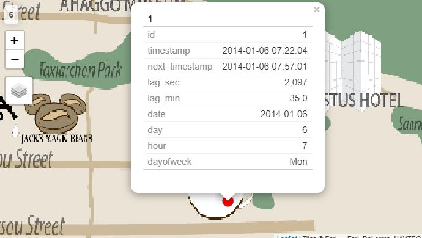
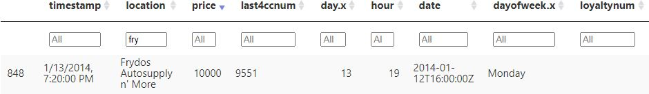
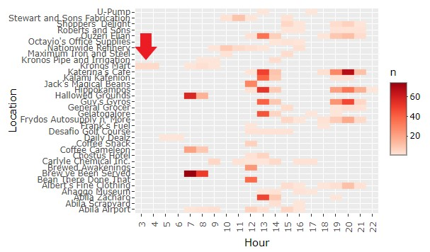
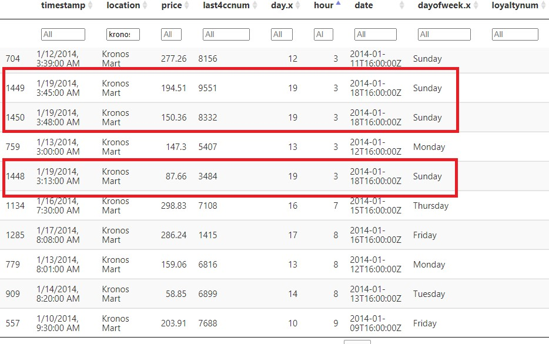
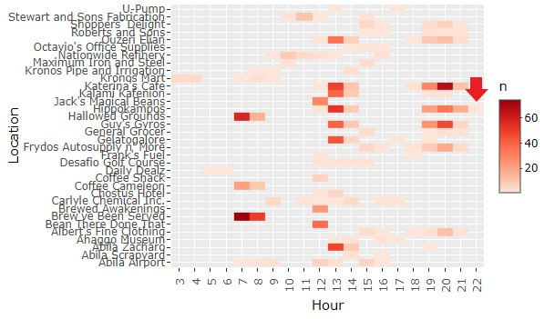

```{r setup, include=FALSE}
knitr::opts_chunk$set(echo = TRUE, message = FALSE, error=FALSE)
```

# Overview

Tethys-based GAStech has been operating a natural gas production site in the island country of Kronos for the past twenty years. The company has produced remarkable profits and developed strong relationships with the government of Kronos. However, GAStech has not been successful in demonstrating environmental stewardship.

In January 2014, the leaders of GAStech are celebrating their newfound fortune as a result of the initial public offering of their very successful company. In the midst of this celebration, several employees of GAStech go missing. An organization known as the Protectors of Kronos (POK) is suspected of the disappearance.

# Objective

Most of the employees of GAStech are provided with company cars approved for both personal and business use. Those who do not have company cars are given access to company trucks, but these cannot be used for personal use. 

The company cars are of much higher quality than the cars the employees would be able to afford otherwise. However, GAStech has installed geospatial tracking software in the company vehicles to track the movements periodically. The vehicle data is available for two weeks prior to the disappearance. 

In addition to the geospatial data, Kronos-based companies provide a benefits card giving the employees discounts and rewards in exchange for collecting the credit card purchases and preferences. The objective of the analysis is to identify suspicious patterns of behavior of the employees to make recommendations for further investigation.

In January 2014, the leaders of GAStech are celebrating their newfound fortune as a result of the initial public offering of their very successful company. In the midst of this celebration, several employees of GAStech go missing. An organization known as the Protectors of Kronos (POK) is suspected of the disappearance.

# Literature review

Literature review was conducted to analyze how the various analyses with similar objectives had been performed earlier and whether those techniques used in the past are applicable to this assignment with/without enhancements.  Also, the issues identified in the previous analyses were also discussed and alternative approaches are provided to overcome those issues. The mini-challenge published in the year 2014 was similar hence a few of those submissions were reviewed before starting this assignment.

1. In the submission by Middlesex University, the credit card and loyalty card usage by the employees of GASTech was visualized by 3D bar plot and it can be inferred that truck drivers tend to spend the most compared to the other employees but it is always advisable to avoid using 3D effects unless we have three-dimensional data. Clear visualizations can be achieved by using interactive 2D plots. Most of the analyses have been performed by custom-made analytical tools which are not accessible by the general public. Hence this assignment is built on R packages to cater wide segment of the audience mainly due to script reproducibility.
2. In the submission by KU Leven University, the daily routine is interestingly visualized by grouping it according to the department type and further faceted by day of the month. A box plot is utilized to find the outliers present for all the locations where the credit cards are used. Though it is spaced perfectly to get a clear view, we were not able to pinpoint the location of the outlier quickly as there are many locations. To overcome this issue, in our assignment I have added interactivity by adding the tooltip so by just hovering the mouse cursor on the outliers shows the corresponding location where the transaction had taken place and in addition to this, other details such as minimum, 25th percentile, median, 75th percentile, maximum values can also be found.
3. In the submission by the University of Buenos Aires,  a heat map is used to visualize the credit card data per hour with sequential colors to find out the abnormalities, though it is visually appealing to find the abnormalities, the exact number of transactions cannot be got from the plot. This issue can be overcome by adding interactivity to the heat map so that the count of the transactions can be known via tooltips just hovering the cursor over the specific points.

## Task 1
**Using just the credit and loyalty card data, identify the most popular locations, and when they are popular. What anomalies do you see? What corrections would you recommend to correct these anomalies?**

All the data extraction, wrangling and preparing the input data required to perform the analysis are done in R using appropriate packages.

*Setting up the environment*

Firstly, it is important to install the necessary R packages and launch them into R Studio environment. The below code chunk checks for the available packages and installs those packages that are not available. In-addition to that, all those packages will be launched into RStudio environment.

raster - To read, write, manipulate, analyze, model spatial data <br>
sf - To support simple features and encode spatial vector data <br>
tmap - To visualize spatial data distributions <br>
tidyverse - A opinionated collection of R packages for data science <br>
clock - Provides a comprehensive library for date-time manipulations <br>
rgdal - Works on both raster and vector data types for manipulating geospatial data <br>
tidytext - Makes text mining tasks easier, more effective and consistent <br>
widyr - To widen the matrix, perform some processing, then turn back to tidy form <br>
DT - To render data objects as HTML tables using JavaScript library <br>
dplyr - A fast, consistent tool for working with data frame like objects <br>
hms - To store and format time-of-day values <br>
ggraph - An extension of ggplot2 for graph and network visualizations<br>
igraph - For simple graphs and network analysis <br>
crosstalk - To support linked brushing and filtering <br>
plotly - To create interactive web graphics and custom interface <br>
data.table - To handle data sets in R <br>
stringi - For fast, correct, consistent, and convenient string/text manipulation <br>
mapview - To create interactive visualizations of spatial data <br>
ggridges - Used for visualizing changes in distributions over time <br>
networkD3 - To create interactive network graphs with JavaScript <br>
htmlwidgets - A framework for creating HTML widgets in R console <br>

```{r}
packages = c('raster','sf','tmap','tidyverse','clock','rgdal','tidytext','widyr',
             'DT','dplyr','hms','ggraph','igraph','crosstalk',
             'plotly','data.table','stringi','mapview','ggridges','networkD3',
             'htmlwidgets')

for(p in packages){
  if(!require(p, character.only = T)){
    install.packages(p)
  }
  library(p, character.only = T)
}
```

*Reading the credit card and loyalty card details*

Importing credit card and loyalty card details into two separate data frames.

```{r}
cc <- read_csv(file = 'data/cc_data.csv')

lc <- read_csv(file = 'data/loyalty_data.csv')
```

*Renaming foreign characters*

A single value under the location column has a non-english character hence replacing the foreign character with alternative english character.

```{r}
setDT(cc)[location %like% "^Katerina", location := "Katerina's Cafe"]
setDT(lc)[location %like% "^Katerina", location := "Katerina's Cafe"]
```

View the columns of the dataset and their respective attributes.

```{r}
glimpse(cc)
glimpse(lc)
```
*Changing data type and extracting new columns*

It can be seen that the timestamp column is in character datatype. Hence, it is converted to timestamp format. After which day, hour and day of the week are extracted from the timestamp column. In addition, the 'last4ccnum' column in the credit card dataset is changed from integer format to character format.

```{r}
cc$timestamp <- date_time_parse(cc$timestamp,
                                zone = "",
                                format = "%m/%d/%Y %H:%M")

lc$timestamp <- date_time_parse(lc$timestamp,
                                zone = "",
                                format = "%m/%d/%Y")


cc <- cc %>%
  mutate(day = get_day(timestamp),
         hour = get_hour(timestamp),
         date = as_date(timestamp))

lc <- lc %>%
  mutate(day = get_day(timestamp))


cc$dayofweek <- weekdays(cc$timestamp)

lc$dayofweek <- weekdays(lc$timestamp)

cc$last4ccnum <- as.character(cc$last4ccnum)
```

*Getting a glimpse after change*

View the columns of the dataset and their respective attributes after pre-processing.

```{r}
glimpse(cc)
glimpse(lc)
```
Usually, the loyalty cards are used along with the credit cards to get some discounts and rewards but there is a mismatch between the total number of records between the credit card transactions (1490) and loyalty card transactions (1392). 

Getting the count of transactions made by the employees with credit cards and loyalty cards in order to find the most frequented and least frequented locations.


# Building the visualization

# Task 1
**Using just the credit and loyalty card data, identify the most popular locations, and when they are popular. What anomalies do you see? What corrections would you recommend to correct these anomalies?**

All the data extraction, wrangling and preparing the input data required to perform the analysis are done in R using appropriate packages.

*Setting up the environment*

Firstly, it is important to install the necessary R packages and launch them into R Studio environment. The below code chunk checks for the available packages and installs those packages that are not available. In-addition to that, all those packages will be launched into RStudio environment.

raster - To read, write, manipulate, analyze, model spatial data <br>
sf - To support simple features and encode spatial vector data <br>
tmap - To visualize spatial data distributions <br>
tidyverse - A opinionated collection of R packages for data science <br>
clock - Provides a comprehensive library for date-time manipulations <br>
rgdal - Works on both raster and vector data types for manipulating geospatial data <br>
tidytext - Makes text mining tasks easier, more effective and consistent <br>
widyr - To widen the matrix, perform some processing, then turn back to tidy form <br>
DT - To render data objects as HTML tables using JavaScript library <br>
dplyr - A fast, consistent tool for working with data frame like objects <br>
hms - To store and format time-of-day values <br>
ggraph - An extension of ggplot2 for graph and network visualizations<br>
igraph - For simple graphs and network analysis <br>
crosstalk - To support linked brushing and filtering <br>
plotly - To create interactive web graphics and custom interface <br>
data.table - To handle data sets in R <br>
stringi - For fast, correct, consistent, and convenient string/text manipulation <br>
mapview - To create interactive visualizations of spatial data <br>
ggridges - Used for visualizing changes in distributions over time <br>
networkD3 - To create interactive network graphs with JavaScript <br>
htmlwidgets - A framework for creating HTML widgets in R console <br>

```{r}
packages = c('raster','sf','tmap','tidyverse','clock','rgdal','tidytext','widyr',
             'DT','dplyr','hms','ggraph','igraph','crosstalk',
             'plotly','data.table','stringi','mapview','ggridges','networkD3',
             'htmlwidgets')

for(p in packages){
  if(!require(p, character.only = T)){
    install.packages(p)
  }
  library(p, character.only = T)
}
```

*Reading the credit card and loyalty card details*

Importing credit card and loyalty card details into two separate data frames.

```{r}
cc <- read_csv(file = 'data/cc_data.csv')

lc <- read_csv(file = 'data/loyalty_data.csv')
```

*Renaming foreign characters*

A single value under the location column has a non-english character hence replacing the foreign character with alternative english character.

```{r}
setDT(cc)[location %like% "^Katerina", location := "Katerina's Cafe"]
setDT(lc)[location %like% "^Katerina", location := "Katerina's Cafe"]
```

View the columns of the dataset and their respective attributes.

```{r}
glimpse(cc)
glimpse(lc)
```
*Changing data type and extracting new columns*

It can be seen that the timestamp column is in character datatype. Hence, it is converted to timestamp format. After which day, hour and day of the week are extracted from the timestamp column. In addition, the 'last4ccnum' column in the credit card dataset is changed from integer format to character format.

```{r}
cc$timestamp <- date_time_parse(cc$timestamp,
                                zone = "",
                                format = "%m/%d/%Y %H:%M")

lc$timestamp <- date_time_parse(lc$timestamp,
                                zone = "",
                                format = "%m/%d/%Y")


cc <- cc %>%
  mutate(day = get_day(timestamp),
         hour = get_hour(timestamp),
         date = as_date(timestamp))

lc <- lc %>%
  mutate(day = get_day(timestamp))


cc$dayofweek <- weekdays(cc$timestamp)

lc$dayofweek <- weekdays(lc$timestamp)

cc$last4ccnum <- as.character(cc$last4ccnum)
```

*Getting a glimpse after change*

View the columns of the dataset and their respective attributes after pre-processing.

```{r}
glimpse(cc)
glimpse(lc)
```
Usually, the loyalty cards are used along with the credit cards to get some discounts and rewards but there is a mismatch between the total number of records between the credit card transactions (1490) and loyalty card transactions (1392). 

Getting the count of transactions made by the employees with credit cards and loyalty cards in order to find the most frequented and least frequented locations.

```{r}
cc_bar <- cc %>%
  count(location, sort=TRUE)

lc_bar <- lc %>%
  count(location, sort=TRUE)
```

*Plotting the most frequented and least frequented locations*

```{r, layout="l-page", fig.width=8, fig.height=6, fig.align='center'}
fig <- plot_ly(cc_bar, x = ~location, y = ~n, type = 'bar', hoverinfo="text", text = ~paste(location,'</br></br>', n),
               marker = list(color = ~n,
                             colorbar = list(title = 'Visits'))) %>%
  layout(title = "Popular locations by credit card transactions",
         xaxis = list(title = "Location", categoryarray = ~location, categoryorder = "array", tickangle                = 270),
         yaxis = list(title = "Visits"))
fig
```

```{r, layout="l-page", fig.width=8, fig.height=6, fig.align='center'}
fig <- plot_ly(lc_bar, x = ~location, y = ~n, type = 'bar', hoverinfo="text", text = ~paste(location,'</br></br>', n),
               marker = list(color = ~n,
                             colorbar = list(title = 'Visits'))) %>%
  layout(title = "Popular locations by loyalty card transactions",
         xaxis = list(title = "Location", categoryarray = ~location, categoryorder = "array", tickangle                = 270),
         yaxis = list(title = "Visits")) 
fig
```

By comparing both the bar plots by credit card and loyalty card transactions, the most popular locations are identified as Katerina's Cafe, Hippokampos, Guy's Gyros and Brew've Been Served. The fifth popular location is Hallowed Grounds according to the number of transactions made by credit card. But there is some anomaly in the usage of loyalty cards in this location as there are mismatches in total credit card transactions and total loyalty card transactions. The total number of credit card transactions in this location is 92 but the total number of loyalty card transactions is only 80. One suspicious transaction that can be observed from the above plot is at location Daily Dealz as there was only one recorded credit card transaction over the period of 14 days and also the loyalty card is not used in this particular location.

Now plotting a heatmap to find out the most visited and least visited locations by hour of the day.

```{r, layout="l-page", fig.width=6, fig.height=8, fig.align='center'}
cc$location <- stri_trans_general(cc$location, "latin-ascii")
x_axis_labels <- min(cc[,'hour']):max(cc[,'hour'])

p <- group_by(cc,hour,location) %>% summarize(n=n()) %>% 
  ggplot(aes(hour,location,fill=n)) + geom_tile() +
  scale_x_continuous(expand=c(0,0),labels = x_axis_labels, breaks = x_axis_labels) +
  theme(axis.text.x = element_text(angle = 90, vjust = 0.5))+
  scale_fill_distiller(palette = "Reds", direction = 1, labels = c(0, 20, 40, 60, "> 80")) +
  labs(title = "Most/least frequented locations by hour of the day", y = "Location", x = "Hour")

ggplotly(p)
```

Hourly popularity can be inferred from the above heatmap. 

Morning 7 am - 9 am

1. Brew've Been Served
2. Hallowed Grounds
3. Coffee Cameleon <br>
The name of these locations suggests that they might serve coffee and snacks. The surge in the morning hours may indicate that the employees tend to have their breakfast/coffee at these locations before going to GASTech.

Noon 12 pm - 2 pm

1. Hippokampos
2. Katerina's Cafe
3. Abila Zachora
4. Gelatogalore
5. Guy's Gyros <br>
This might be the lunchtime for the GASTech employees. The list shows only the top 5 locations between 12 pm - 2 pm. But unlike breakfast locations which were limited to only three highly sought-after outlets, the employees tend to have various options for lunch.

Evening 7 pm - 9 pm

1. Katerina's Cafe
2. Guy's Gyros
3. Hippokampos
4. Frydos Autosupply n' More
5. Ouzeri Elian <br>
This should be the dinner time for the employees. The time period corresponding to morning and noon seem to have locations related to food and beverages. But between 7 pm - 9 pm, there seems to be some surge in visitors at Frydos Autosupply n' More.

Below is a heatmap to find out the most visited and least visited locations by day of the month.

```{r, layout="l-page", fig.width=6, fig.height=8, fig.align='center'}
cc$location <- stri_trans_general(cc$location, "latin-ascii")
x_axis_labels <- min(cc[,'day']):max(cc[,'day'])

p <- group_by(cc,day,location) %>% summarize(n=n()) %>% 
  ggplot(aes(day,location,fill=n)) + geom_tile() +
  scale_x_continuous(expand=c(0,0),labels = x_axis_labels, breaks = x_axis_labels) +
  theme(axis.text.x = element_text(angle = 90, vjust = 0.5))+
  scale_fill_distiller(palette = "Reds", direction = 1) +
  labs(y= "Location", x = "Day Of Month", title = "Most/least frequented locations by day of month")

ggplotly(p)
```

Over the 14 days period, places such as Katerina's Cafe, Hippokampos and Guy's Gyros are popular. One of the other popular places is Brew've Been Served but there are no transactions on both the weekends so we can infer that this outlet is closed on weekends. 

Below is a heatmap to find out the most visited and least visited locations by day of the week.

```{r, layout="l-page", fig.width=6, fig.height=8, fig.align='center'}
cc$location <- stri_trans_general(cc$location, "latin-ascii")
x_axis_labels <- min(cc[,'day']):max(cc[,'day'])

p <- group_by(cc,dayofweek,location) %>% summarize(n=n()) %>% 
  ggplot(aes(dayofweek,location,fill=n)) + geom_tile() + 
  scale_fill_distiller(palette = "Reds", limits = c(0,10), na.value = "#de2d26",
                       direction = 1, labels = c(0.0, 2.5, 5.0, 7.5, "> 10.0")) +
  labs(y= "Location", x = "Day Of Week", title = "Most/least frequented locations by day of week") +
  theme(axis.text.x = element_text(angle = 90, vjust = 0.5), panel.grid.major = element_blank())

ggplotly(p)
```

Weekends usually tend to have fewer visitors compared to weekdays. And some of the outlets had no transactions made during the weekends but had a decent number of transactions during weekdays implying that few outlets may be closed on weekends.

*Joining credit card data and loyalty card data*

Using a left join to merge loyalty card data with credit card data to map all the transactions. 

```{r}
merged_cards <- left_join(cc, lc, by = c("date" = "timestamp", "location" = "location", "price" = "price"))
glimpse(merged_cards)
```
After the left join, the total number records increased from 1490 to 1496, this hows that multiple loyalty cards have been used to single credit card owners.

Below are the list of loyalty cards that were used by more than one credit card owners.

```{r}
t <- merged_cards %>% 
  na.omit() %>%
  group_by(loyaltynum) %>%
  summarise(count = n_distinct(last4ccnum))

t %>%
  filter(count>1)
```

Mapping the corresponding credit card details to the loyalty card detils and getting the number of transactions performed.

```{r}
bt <- merged_cards %>%
  filter(loyaltynum %in% c("L2070","L2247","L3288","L3295","L6119",
                           "L6267","L8566","L9406")) %>%
  group_by(last4ccnum, loyaltynum) %>%
  summarise(n=n())

bt
```

Plotting the price distribution using ridge plot to get a sense of transaction ranges at different locations. The price column is transformed to log scale to get a better visualization.

```{r, layout="l-page", fig.width=6, fig.height=5, fig.align='center'}
ggplot(data = cc, aes(x=log(cc$price+1), y=location,
                           fill = 0.5 - abs(0.5 - stat(ecdf))
                           ))+
  geom_density_ridges_gradient(scale = 3, rel_min_height = 0.01, gradient_lwd = 1., calc_ecdf = TRUE) +
  theme_ridges(font_size = 12, grid = FALSE)+
  scale_fill_viridis_c(name = "Tail probability", direction = -1) +
  labs(
    y= "Location",
    x = "Price (logscale)",
    title = "Price distribution by location"
  ) +
  theme(
axis.title.x = element_text(hjust = 0.5),
axis.title.y = element_text(hjust = 0.5)
)
```
This ridge plot is used to display the transaction price distribution across all the locations visited by the employees of GASTech. Transaction price is expressed in log scale for better visualization. Locations such as U-Pump, Maximum Iron and Steel, Kronos Pipe and Irrigation, Carlyle Chemical Inc., Abila Airport, Abila Scrapyard and Nationwide Refinery were the high priced transactions had taken place.

Below is a interactive data table with credit card transaction details which can be utilised at a later stage of the analysis.

```{r}
DT::datatable(cc,
              filter = 'top') %>%
  formatStyle(columns = 0,
              target = 'row',
              lineHeight = '100%') %>%
  formatDate(1, "toLocaleString")
```
A granular level information can be got by referring the interactive data table to check for any anomalies throughout this analysis.

Below is a interactive data table with credit card transaction details and loyalty card transaction details to know the credit card and loyalty card pairs that had been used together.

```{r}
DT::datatable(merged_cards,
              filter = 'top') %>%
  formatStyle(columns = 0,
              target = 'row',
              lineHeight = '100%') %>%
  formatDate(1, "toLocaleString") %>%
  formatDate(7, "toLocaleDateString")
```

The below data table shows the unique transaction and total transaction details based on the locations.

```{r}
z <- cc %>%
  group_by(location) %>%
  summarise(unique = n_distinct(last4ccnum), total=n())

DT::datatable(z,
              filter = 'top') %>%
  formatStyle(columns = 1,
              target = 'row',
              lineHeight = '100%')
```

## Task 2
**Add the vehicle data to your analysis of the credit and loyalty card data. How does your assessment of the anomalies in question 1 change based on this new data? What discrepancies between vehicle, credit, and loyalty card data do you find? Please limit your answer to 8 images and 500 words.**

**Importing raster file**

```{r }
bgmap <- raster("data/MC2-tourist.tif")
bgmap
```

**Plotting Raster Layer**

```{r }
tm_shape(bgmap) +
  tm_rgb(bgmap, r = 1, g = 2, b = 3,
         alpha = NA,
         saturation = 1,
         interpolate = TRUE,
         max.value = 255)
```

The map of Abila gives us a clear picture of the distance that GASTech is away from the other locations visited by the employees. From the map of Abila, the most frequented locations such as Katerina's Cafe, Guy's Gyros, Brew've Been Served were all seems to be in close proximity with GASTech. Hippokampos was the second most frequented location but surprisingly it was not present in the map. Since the top 4 frequented locations are closely located, I assume Hippokampos also should be near to GASTech.

**Importing vector GIS data file**
 
```{r }
Abila_st <- st_read(dsn = "data/Geospatial",
                    layer = "Abila")
```

**Importing Aspatial Data**

```{r }
gps <- read_csv("data/gps.csv")
glimpse(gps)
```

**Converting Date-Time field and ID field**

```{r }
gps$Timestamp <- date_time_parse(gps$Timestamp,
                                 zone = "",
                                 format = "%m/%d/%Y %H:%M:%S")
gps$id <- as_factor(gps$id)
```

**Converting Aspatial Data Into A Simple Feature data Frame**

```{r }
gps_sf <- st_as_sf(gps,
                   coords = c("long","lat"),
                   crs = 4326)
```

```{r }
gps_sf <- gps_sf %>%
  mutate(day = get_day(Timestamp),
         hour = get_hour(Timestamp),
         dayofweek = date_weekday_factor(Timestamp) ,
         date = as_date(Timestamp))
```

```{r}
glimpse(gps_sf)
```

**Creating Movement Path From GPS Points**

The code chunk below joins the GPS points into movement paths by using car id, date and hour as unique identifiers.

```{r }
gps_path <- gps_sf %>%
  group_by(id, date, hour) %>%
  summarize(timestamp= mean(Timestamp),
            do_union=FALSE) %>%
  st_cast("LINESTRING")
```

**Finding the orphan lines**

After getting the movement paths we do see some orphan GPS points hence finding those orphan lines.

```{r} 
p = npts(gps_path, by_feature = TRUE)
gps_path2 <- cbind(gps_path, p)
```

**Removing the orphan lines**

```{r} 
gps_path3 <- gps_path2[!(gps_path2$p==1),]
```

**Plotting the GPS Paths**

Below code chunk is used to overplot the GPS path of all the car ids onto the background tourist map.

```{r }
gps_path_selected <- gps_path3
tmap_mode("view")
tm_shape(bgmap) +
  tm_rgb(bgmap, r = 1, g = 2, b = 3,
         alpha = NA,
         saturation = 1,
         interpolate = TRUE,
         max.value = 255) +
  tm_shape(gps_path_selected) +
  tm_lines(col='red')
```

Previously using the heat map plot on location vs hour of transaction shows that there are some transactions recorded at early morning around 3 am - 4 am at Kronos Mart. Hence further plotting the GPS path during the time period to see if any car id had passed by that way.

```{r }
gps_path_selected <- gps_path3 %>%
  filter(hour==3)
tmap_mode("view")
tm_shape(bgmap) +
  tm_rgb(bgmap, r = 1, g = 2, b = 3,
         alpha = NA,
         saturation = 1,
         interpolate = TRUE,
         max.value = 255) +
  tm_shape(gps_path_selected) +
  tm_lines(col="red") 
```

It can be seen from the GPS data that no car had passed by Kronos mart or its near by locations between 3 am - 4 am. Hence the employee should have taken his personal vehicle or should have visited that particular location by a walk in order to hide his/her identity. The owners of credit card numbers ending with 8332, 9551 and 3484 are those who had made transaction on 19/01/2014 (Sunday) between 3 am - 4 am. Transaction gap between credit card numbers 8332 and 9551 were only three minutes. And all the three transactions were made without the use of loyalty cards.

Plotting the GPS path during the 10 pm - 11 pm to see if any car id had passed by that way. 

```{r }
gps_path_selected <- gps_path3 %>%
  filter(date > '2014-01-09', date < '2014-01-11', hour == 22)
tmap_mode("view")
tm_shape(bgmap) +
  tm_rgb(bgmap, r = 1, g = 2, b = 3,
         alpha = NA,
         saturation = 1,
         interpolate = TRUE,
         max.value = 255) +
  tm_shape(gps_path_selected) +
  tm_lines(col="red") 
```


The last 4 digit of the credit card is 2463 for the transaction between 10pm-11pm on 10/01/2014 Friday at location Hippokampos. But surprisingly the particular location is not seen in the map.

Below GPS path had been plotted for car id 28.
 
```{r }
gps_path_selected <- gps_path3 %>%
  filter(id == 28)
tmap_mode("view")
tm_shape(bgmap) +
  tm_rgb(bgmap, r = 1, g = 2, b = 3,
         alpha = NA,
         saturation = 1,
         interpolate = TRUE,
         max.value = 255) +
  tm_shape(gps_path_selected) +
  tm_lines(col="red") 
```

By glazing through the routes visited by the employee car 28, there is an evident difference observed in the GPS path of car ID 28. Other car IDs have some regular pattern but the path taken by car ID 28 is highly disoriented and has many off-road impressions.

```{r }
gps_path_selected <- gps_path3 %>%
  filter(date=='2014-01-13' & hour>=19 & hour<20)
tmap_mode("view")
tm_shape(bgmap) +
  tm_rgb(bgmap, r = 1, g = 2, b = 3,
         alpha = NA,
         saturation = 1,
         interpolate = TRUE,
         max.value = 255) +
  tm_shape(gps_path_selected) +
  tm_lines(col="red") 
```

Car IDs - 13,15,16,34 GPS points impression can be seen around Frydos Autosupply on 13/01/2014 between 7pm-8pm as there was an unusal transaction. It will be further analysed at a later stage.

# Task 3
**Can you infer the owners of each credit card and loyalty card? What is your evidence? Where are there uncertainties in your method? Where are there uncertainties in the data? Please limit your answer to 8 images and 500 words.**

**Finding the lag**

Since the GPS moving data is captured, it is hard to find the location were the car had stopped to make a transaction. So, I have taken the difference between consecutive timestamp grouped by ids and filter the points with more than 2 minutes difference.

```{r}
gps_lag <- gps_sf %>%
  group_by(id) %>%
  mutate(next_timestamp = lead(Timestamp, order_by = Timestamp))
```

```{r}
names(gps_lag)[names(gps_lag)=='Timestamp'] <- 'timestamp'
gps_lag <- gps_lag[c("id","timestamp", "next_timestamp","date","day","hour","dayofweek","geometry")]
```

```{r}
gps_lag$lag_sec <- as.numeric(gps_lag$next_timestamp - gps_lag$timestamp)
gps_lag <- gps_lag[c("id","timestamp", "next_timestamp","lag_sec", "date","day","hour","dayofweek","geometry")]
gps_lag <-gps_lag[order(gps_lag$id, gps_lag$timestamp),]
gps_lag$lag_min <- as.numeric(gps_lag$lag_sec)/60
gps_lag <- gps_lag[c("id","timestamp", "next_timestamp","lag_sec","lag_min", "date","day","hour","dayofweek","geometry")]
```

Filtering only the stationary points where the car has stopped for more than 2 minutes and less than 360 minutes (i.e) 6 hours. An employee is assumed to be at his home if the time lag between consecutive points are more than 6 hours.

```{r}
gps_loc <- gps_lag %>%
  filter(lag_min>2, lag_min<360)
```

Preparing the data to plot as dots on the background tourist map.

```{r }
gps_loc <- separate(gps_loc, geometry, into = c("long", "lat"), sep = ",")
gps_loc$long <- gsub("c\\(", "", gps_loc$long)
gps_loc$lat <- gsub("\\)", "", gps_loc$lat)
```

```{r}
gps_dot_sf <- st_as_sf(gps_loc,
                       coords = c("long","lat"),
                       crs = 4326)
```


```{r}
glimpse(gps_dot_sf)
```

Previously movement data had been plotted onto the background tourist map. Now the stationary points data is plotted onto the background tourist map. The day is filtered to 6 for now but during analysis, the filter criteria would be changed to meet the needs.

```{r}
gps_dot <- gps_dot_sf %>%
  filter(day==6)

tmap_mode("view")
tm_shape(bgmap) +
  tm_rgb(bgmap, r = 1, g = 2, b = 3,
         alpha = NA,
         saturation = 1,
         interpolate = TRUE,
         max.value = 255) +
tm_shape(gps_dot)+
tm_bubbles(col = "red",
           size = 1, 
           size.max = 1,
           border.col = "black",
           border.lwd = 1) +
  tm_facets(by = 'id',
            ncol = 1,
            scale.factor = 5)
```

Below csv file holding the car id, name, department, employee designation are loaded into a dataframe.

```{r}
net <- read_csv(file = 'data/car-assignments.csv')
```

**Combining the first name and last name of the employees**

The first name and the last name column are combined together to get the full name of the employee after which the first name and last name columns are dropped as they are no longer needed.

```{r}
net <- net %>%
  unite('Merged', LastName:FirstName, sep= " ", remove = FALSE)
net <- net %>%
  rename(Name = Merged)
glimpse(net)
net <- select(net, -c(FirstName, LastName))
```
In order to link the employee name to credit card details, the GPS points are plotted in the map as dots for each card id using the facet function and then filtered by any one day of the month. So now we have the dots in the map with stop time and start time as shown below.

<center>


</center>

It can be inferred from the snapshot above that car id 1 had stopped at Hallowed grounds on 2014-01-06 for about 35 minutes from 7:22 am to 7:57 am. Now the same record is to verified from credit card DT table as shown below.

<center>


</center>

It can seen that there are few transactions that took place between 7:22 am and 7:57 am on 2014-01-06. So in this case we have see for other points in the map where the car had stopped and repeat the same process. If we can pinpoint on one of the credit card details without any overlap from other transactions, then we can link the corresponding credit card and car id. Sometimes it gets complicated so in these cases we have look for different days to zero down on the car id and credit card number.

**Mapping the car assignment based on last 4 digits of the credit card**

```{r}
cc_full <-cc %>%
  mutate(CarID = case_when(
    last4ccnum == "9551" ~ 1,
    last4ccnum == "4434" ~ 2,
    last4ccnum == "8332" ~ 3,
    last4ccnum == "7688" ~ 4,
    last4ccnum == "6899" ~ 5,
    last4ccnum == "7253" ~ 6,
    last4ccnum == "1321" ~ 7,
    last4ccnum == "7889" ~ 8,
    last4ccnum == "3853" ~ 9,
    last4ccnum == "9635" ~ 10,
    last4ccnum == "7117" ~ 11,
    last4ccnum == "7108" ~ 12,
    last4ccnum == "5368" ~ 13,
    last4ccnum == "1874" ~ 14,
    last4ccnum == "9241" ~ 15,
    last4ccnum == "2142" ~ 16,
    last4ccnum == "8411" ~ 17,
    last4ccnum == "9617" ~ 18,
    last4ccnum == "6895" ~ 19,
    last4ccnum == "6816" ~ 20,
    last4ccnum == "4948" ~ 21,
    last4ccnum == "2681" ~ 22,
    last4ccnum == "3484" ~ 23,
    last4ccnum == "9405" ~ 24,
    last4ccnum == "5921" ~ 25,
    last4ccnum == "1310" ~ 26,
    last4ccnum == "3492" ~ 27,
    last4ccnum == "7384" ~ 28,
    last4ccnum == "3547" ~ 29,
    last4ccnum == "7819" ~ 30,
    last4ccnum == "7792" ~ 31,
    last4ccnum == "2540" ~ 32,
    last4ccnum == "9683" ~ 33,
    last4ccnum == "8202" ~ 34,
    last4ccnum == "8156" ~ 35
    )
)
```


```{r}
glimpse(cc_full)
```

```{r}
temp <- net[c("CarID", "Name")]
cc_full <- left_join(cc_full, temp, by = "CarID")

cc_full_nonull <- cc_full %>% filter(!is.na(CarID))
```

```{r}
temp2 <- cc_full_nonull[,c("timestamp","CarID","Name","location","price","last4ccnum","date")]

temp3 <- lc[,c("timestamp","location","price","loyaltynum")]

dt_linked <- left_join(temp2, temp3, by = c("date" = "timestamp", "location" = "location", "price" = "price"))
  
DT::datatable(dt_linked,
              filter = 'top') %>%
  formatStyle(columns = 1,
              target = 'row',
              lineHeight = '100%') %>%
  formatDate(1, "toLocaleString") %>%
  formatDate(7, "toLocaleDateString")
```
The interactive data table above provides the car id and name of the employee linked to the credit card and loyalty card details.

## Task 4
**Given the data sources provided, identify potential informal or unofficial relationships among GASTech personnel. Provide evidence for these relationships. Please limit your response to 8 images and 500 words.**

Clubbing the car id with that of the employee name and reordering the columns.

```{r}
sp <- net %>%
  unite('Merged', CarID:Name, sep= " ", remove = TRUE)

sp <- sp %>%
  rename(Employee = Merged)

sp <- sp[c("Employee","CurrentEmploymentTitle","CurrentEmploymentType")]
```

```{r}
bt <- merged_cards %>%
  filter(loyaltynum %in% c("L2070","L2247","L3288","L3295","L6119",
                           "L6267","L8566","L9406")) %>%
  group_by(last4ccnum, loyaltynum) %>%
  summarise(n=n())

bt
```

Plot a network graph to show the relationship between credit cards and loyalty cards.

```{r}
df <- bt[, c(1, 2)]
g <- graph_from_data_frame(df)
V(g)$type <- bipartite_mapping(g)$type
plot(g)
```

Credit card numbers ending with 9241 & 1286 share the same loyalty card and 6691 & 6899 share the same loyalty card. Therefore we can infer that there is some close between owners of credit card numbers ending with 9241 and 1286. Similarly, there should be some close relationship between owners of credit card numbers ending with 6691 and 6899.

Others possible close relationships can be established between the owners of the credit card ending with pairs 5368<->7889, 5921<->4948, 4795<->8332. Because in all these three pairs have two loyalty cards as common between them. Say for example if see the directed network relationship between 5368 and 7889, we can infer that sometimes the 5368 card owner uses either L6119 or L2247. Similarly, the 7889 card owner also uses either L6119 or L2247.

Below data table shows the corresponding employment title and employment type of the employees.

```{r}
DT::datatable(sp,
              filter = 'top') %>%
  formatStyle(columns = 1,
              target = 'row',
              lineHeight = '100%')
```


## Task 5
**Do you see evidence of suspicious activity? Identify 1- 10 locations where you believe the suspicious activity is occurring, and why Please limit your response to 10 images and 500 words**

1. Frydos Autosupply n' More

```{r, layout="l-page", fig.width=6, fig.height=8, fig.align='center'}
plot_ly(cc, x = ~price, y = ~location) %>%
  add_boxplot() %>%
  layout(yaxis = list(title = "Location", tickmode='linear'),
         xaxis = list(title = "Price"), 
         title = "Location vs Transaction value")
```

The box plot shows that there is an extreme outlier for a transaction price of 10000 in Frydos Autosupply n’ More on 13/01/2014 7:20 PM.

<center>


</center>

This suspicious transaction was made by Calixto Nils without using loyalty card. Loyalty cards are ideally used when the purchase amount is higher in order to get some discounts/benefits. Also the second highest spent amount by credit card 9551 was only 276.9. This shows that he was not a lavish spender.

2. Kronos Mart

<center>


</center>

Kronos Mart which is located far away from GASTech had suspicious transactions around 3 am - 4 am on s Sunday. In addition, the credit card number ending with 9551 had also made a transaction around 3:45 am. These early morning transactions needs to be investigated. None of transactions in Kronos Mart had used loyalty card. Balas Felix, Calixto Nils  and Lagos Varja had made some purchases between 3 am - 4 am. The time interval between Balas Felix and Calixto Nils is only three minutes.

<center>


</center>

3. Hippokampos

<center>


</center>

One midnight transaction had happened between 10 pm - 11 pm on a Friday in Hippokampos. The location of hippokampos is not shown in the background map but going by the assumption, the location of Hippokampos should be near by Katerina's Cafe and Guy's Gyros. Loyalty card has not been used for this transaction as well.

<center>


</center>

4. Daily Dealz

<center>


</center>

During the 14 day period, Daily Dealz location was visited only once which makes this transaction suspicious. 

<center>


</center>

Surprisingly, this transaction is also made by Calixto Nils who was already linked to two of the suspicious locations above. Loyalty card was not used here as well.

5. Abila Scrapyard

<center>


</center>

Abila Scrapyard was visited only by a single employee 4 times in this 14 days. In addition, there seems to be a pattern as the employee holding the credit card ending with 2276 had visited Abila Scrapyard during Tuesday and Thurday in both week 1 and week 2.

<center>


</center>

6. Coffee Shack

<center>


</center>

F&B outlets are those locations that attract more customers. If we see the most popular locations, F&B locations hold the top positions but Coffee Shack outlet located near Albert's Fine Clothing was only visited by a single employee 8 times within 14 day period. And also the timestamp recorded seems to be ambiguous as all the transactions were recorded at 12:00 PM. The employee is identified as Calzas Axel.

<center>


</center>

7. Albert's Fine Clothing

```{r, layout="l-page", fig.width=6, fig.height=8, fig.align='center'}
plot_ly(cc, x = ~price, y = ~location) %>%
  add_boxplot() %>%
  layout(yaxis = list(title = "Location", tickmode='linear'),
         xaxis = list(title = "Price"), 
         title = "Location vs Transaction value")
```

There is an outlier in Albert's Fine Clothing. Usual transaction were only below 308.36 but one transaction stood out among others are 1239.41. Orilla Elsa is found to be the credit card owner.

<center>


</center>

All the other transactions by Orilla were less than 120.65. So, further investigation is required on what made her spend 10 times the second highest amount in her transaction.

<center>


</center>

8. Chostus Hotel

```{r, layout="l-page", fig.width=6, fig.height=8, fig.align='center'}
plot_ly(cc, x = ~price, y = ~location) %>%
  add_boxplot() %>%
  layout(yaxis = list(title = "Location", tickmode='linear'),
         xaxis = list(title = "Price"), 
         title = "Location vs Transaction value")
```

Chostus hotel had one extreme outlier of 600 by credit card number ending with 5010. The usual transactins ranges between 100-200. So this has to be investigated. And there seems to be pattern between Tempestad Brand and Strum Orhan as these two employees visit Chostus hotel on same days over the two weeks. Transaction time is also same for these two employees.

<center>


</center>

<center>
<font size="2">*This was written as part of requirements for the [Visual Analytics](https://wiki.smu.edu.sg/2021t2isss608/Course_information) course offered by [MITB](https://scis.smu.edu.sg/master-it-business).*</font size="2">
</center>


