```{r setup, include=FALSE}
knitr::opts_chunk$set(echo = FALSE)
```

## 1.0 Critique of Visualisation

The original visualization can be seen below.

<center>
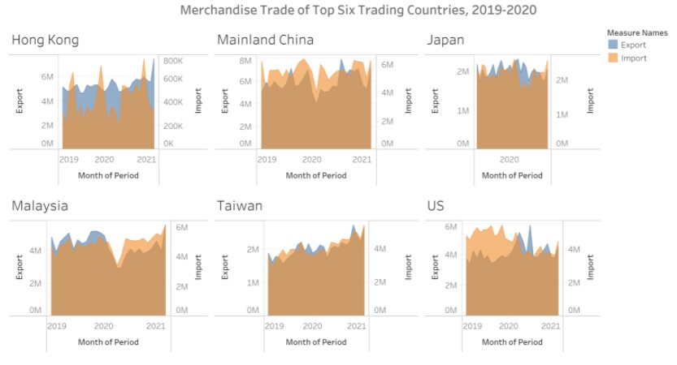

</center>
### 1.1 Clarity

1.	The title of the graph says the merchandise trade from 2019 to 2020. But most of the sub charts have three years from 2019 to 2021. The chart corresponding to Japan has only the year 2020 mentioned in the x-axis. 
2.	The y-axis scale for all the 6 different countries is not consistent. From the chart, if you see China and Japan seems to have similar export and import trend in fact Japan’s trade seems to be more than China’s but observing the y-axis scale closely reveals that China’s scale is from 0M-8M whereas Japan’s scale is only from 0M-2M. The dual axis present in the y-axis should also be in the same scale. Consistent scale should always be used when we have similar charts side by side.
3.	The x-axis label says ‘Month of Period’ but the x-axis values correspond to year and not month.
4.	Unit of measurement is nowhere mentioned in the graph. Since there are six different countries with different currencies, it is important to mention the unit of measurement.
5.	The source of the chart is not present.
6.	Area chart is mostly preferred only to show how parts of a whole change over time. From our area chart, it is very hard to infer any insights. It is always recommended to avoid using classic area chart as it is too confusing.

### 1.2 Aesthetics

1.	The use of colours to distinguish exports and imports are too pale. And since most of the sub charts have those two colours overlapped, it is very hard to understand. Brighter and distinct coloration should be used.
2.	The font size of the main title for the chart is smaller than the other sub header such as country names in the chart.
3.	Tick marks are not present in y-axis. Tick marks are necessary on continuous scale.
4.	The sub headers such as country names present in the chart are left aligned. And since there are no gridlines, at times it gets confusing.
5.	Annotations are not used to convey the key insights, leaving the reader to infer the purpose of the chart.

## 2.0 Alternative Design

The proposed design is as follows.

<center>
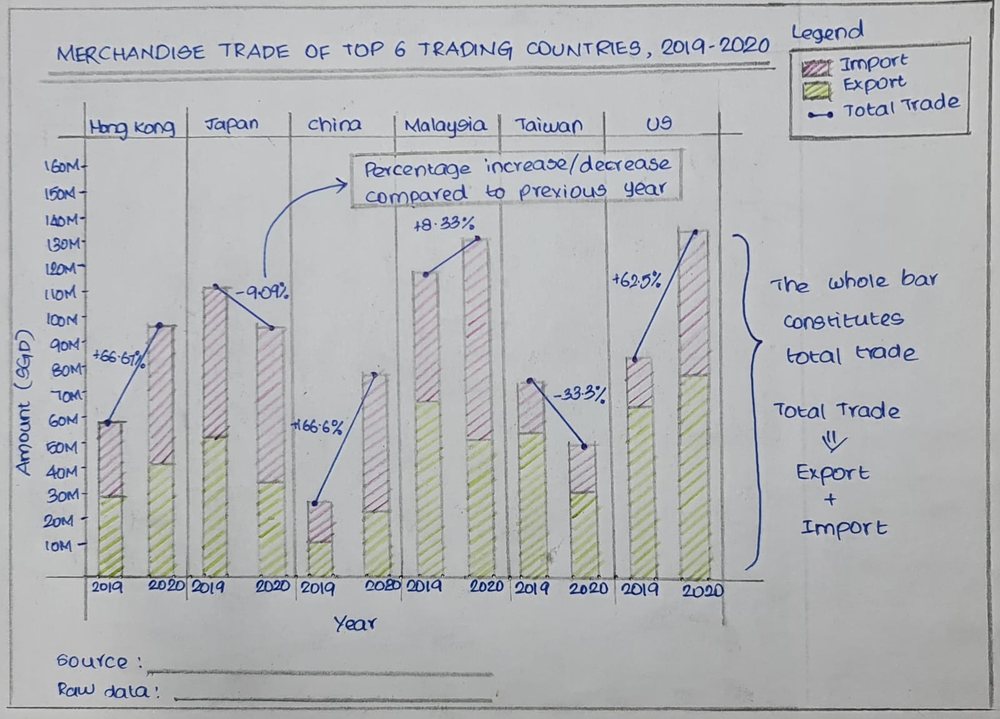

</center>
### 2.1 Clarity

1. The x-axis of all the countries has the same year range as mentioned in the main title of the chart. 
2. The area chart is replaced by stacked bar chart which gives the overall picture of the total trade happened in the corresponding year.
3. Line chart is used on top of the stacked bar chart to show the rate of increase/decrease in trade from that of the previous year. Percentage increase/decrease is also shown in the chart to quantify the rate of change.
4. All the six countries share the same y-axis so that it will be easy for comparison and draw insights.
5. Link to the source and raw data are provided at the bottom of the chart.
6. Unit of measurement is clearly mentioned in the y-axis as there are different countries using different currencies.
7. The raw data excel file has a scale of thousand dollars so all the values are multiplied by 1000 to get the actual value of exports and imports.

### 2.2 Aesthetics

1.	In y-axis, tick marks are used since it is in a continuous scale.
2.	Soft and natural colours are used to distinguish export and import.
3.	Gridlines are used to separate six different countries.
4.	Annotations are used to emphasize key observations. 

## 3.0 Proposed Visualisation

Please view the interactive visualization on [Tableau Public](https://www.linkedin.com/in/mayurapriyann/) here.

## 4.0 Step-by-step Guide

1.	Import the excel sheet(outputFile.xlsx) into Tableau Prep builder. The first five rows in the excel sheet contains non tabular data which needs to be excluded.

<center>
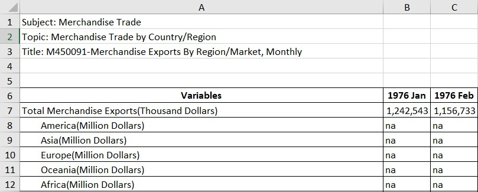

</center>

Check the ‘Data Interpreter’ check box to handle this issue. It is designed to help identify the structure of the data in excel file and turn it into a proper format. 

<center>
{width=50%}

</center>
2.	Rename the first sheet T1 as ‘Imports’ and add the ‘Clean step’

<center>
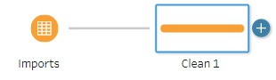{width=50%}

</center>
The data table which was cleaned by data interpreter is displayed as shown below.

<center>
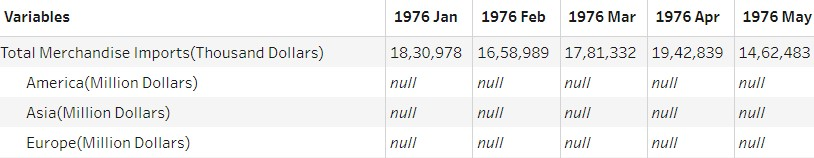

</center>

If you can notice, the first five rows are removed and correct table header is assigned automatically.

3.	The country names are listed under column ‘Variables’. But since we are interested in only the 6 countries given in the visualization, use the filter function next to the ‘Variable’ column to filter out the 6 countries.

<center>
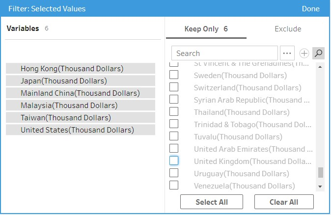

</center>
4.	Since we are interested only in the year 2019-2020, drop all the other data range by selecting the desired date range and click ‘Remove Field’.

<center>
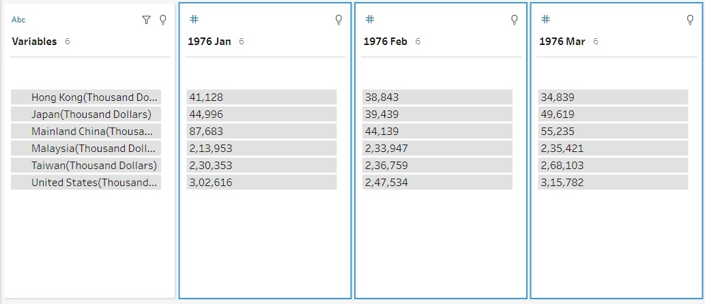

</center>

Repeat the steps 1-4 for the second sheet T2 and rename the sheet to ‘Exports’.

5.	The output table got is in wide format.  Each month date is listed as separate measure as shown below. Wide format is not suitable for analysis, hence wide format has to be transformed to long format.

<center>
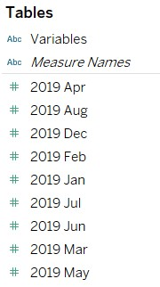{width=20%}

</center>

<center>
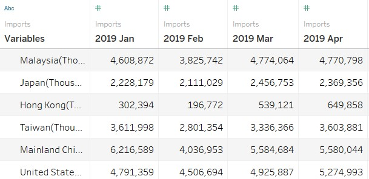{width=75%}

</center>
Hence, after clean step add pivot step to convert wide format to long format and rename the columns as shown below.

<center>
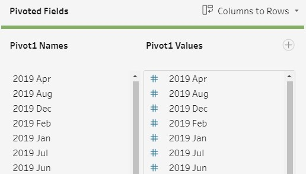{width=75%}

</center>

<center>
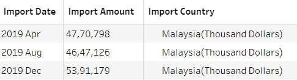{width=50%}

</center>
6.	After pivoting and renaming the columns, both the sheets are saved into separate excel sheets namely ‘Imports.xlsx’ and ‘Export.xlsx’.

<center>
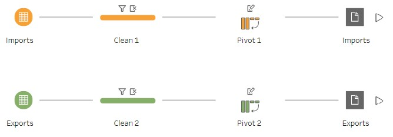{width=50%}

</center>
7.	Now import both the tables into Tableau. The pull any one of the tables to the canvas and double click on the table to open the join canvas (physical layer).

<center>
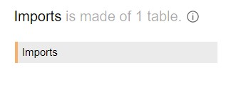{width=30%}

</center>
8.	Drag another table to the join canvas.

<center>
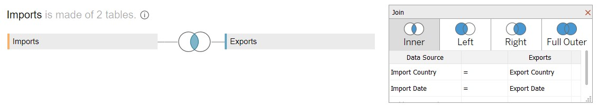

</center>

As ‘Country’ and ‘Date’ column are common both the tables, we can use an inner join to join both the tables as shown in the screenshot. The final table after joining both the tables is shown below.

<center>
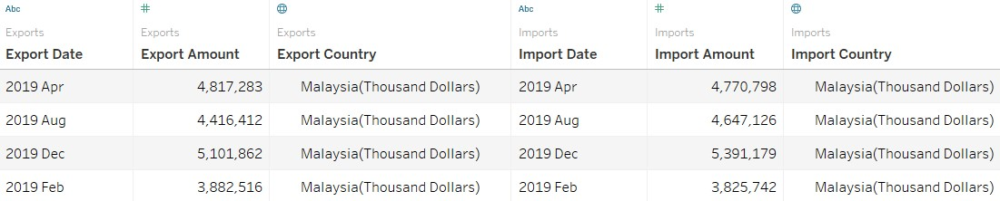

</center>
9.	Now date column and country column of any one of the tables is retained as both will have the same value. Country column is split with ‘(‘ as delimiter to retain only the country name.

<center>
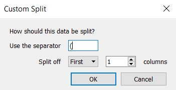{width=30%}

</center>

Date column has data type as string. It has to be changed to date data type.
The final table looks like below.

<center>
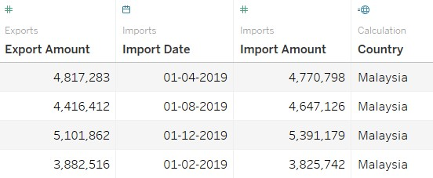{width=70%}

</center>
10.	The scale in the raw data file is in thousand dollars, so both the ‘Import Amount’ and ‘Export Amount’ are multiplied by 1000 to get the absolute value of import and export.

<center>
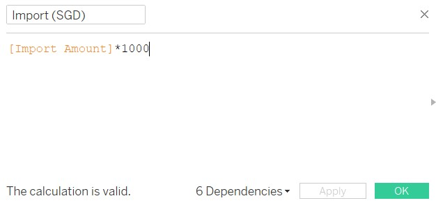{width=50%}

</center>

The new calculated columns are named as ‘Import (SGD)’ and ‘Export (SGD)’.

11.	A calculated column ‘Total Trade (SGD)’ is obtained by summing both the ‘Import (SGD)’ and ‘Export (SGD)’.

<center>
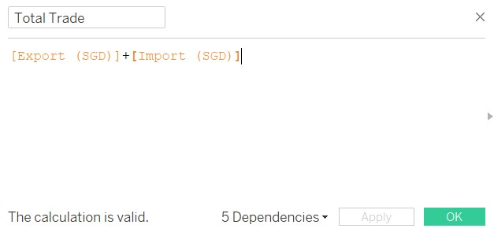{width=50%}

</center>
12.	Drag ‘Country’ and ‘Date’ to columns pane.

<center>
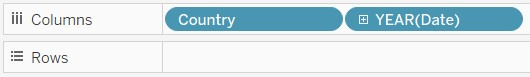{width=50%}

</center>
13.	Drag ‘Measure Values’ to rows pane.

<center>
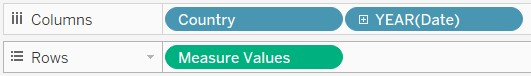{width=50%}

</center>
14.	‘Measure Values’ consists of 6 values as shown below.

<center>
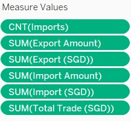{width=20%}

</center>

Remove ‘CNT(Imports)’ , ‘SUM(Export Amount)’, ‘SUM(Import (Amount)’ and ‘SUM(Total Trade (SGD))’ from the ‘Measure Values’ column. The chart looks like below.

<center>
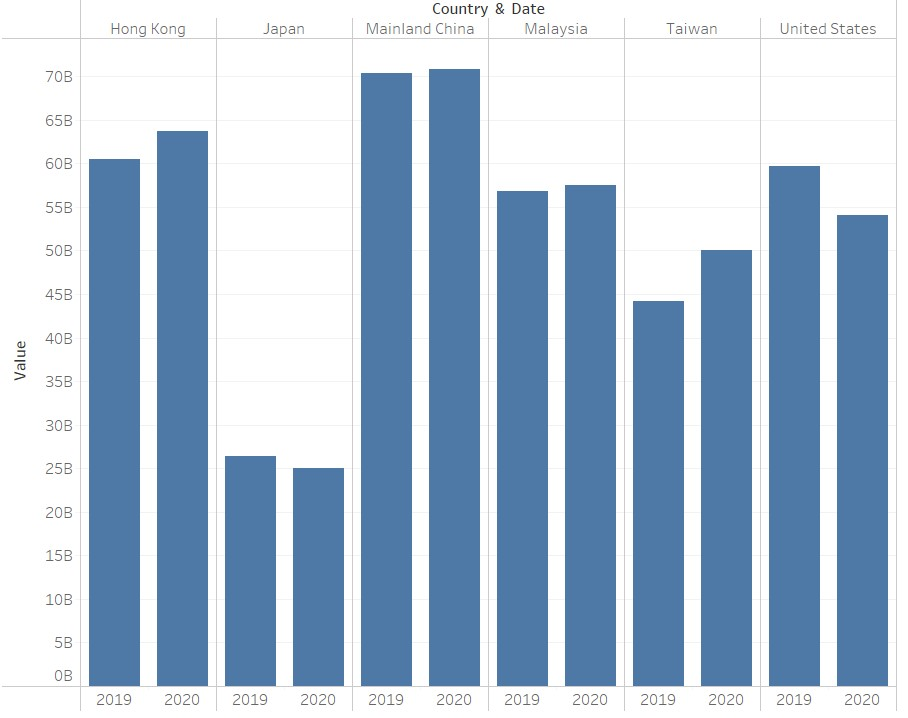

</center>
15.	Now drag and drop ‘Measure Names’ on colour icon under the ‘Marks’. Under colour icon click on ‘Edit colours’ and select the desired colours.

<center>
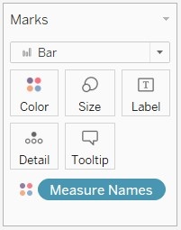{width=20%}

</center>

The stacked bar chart is ready as shown below.

<center>
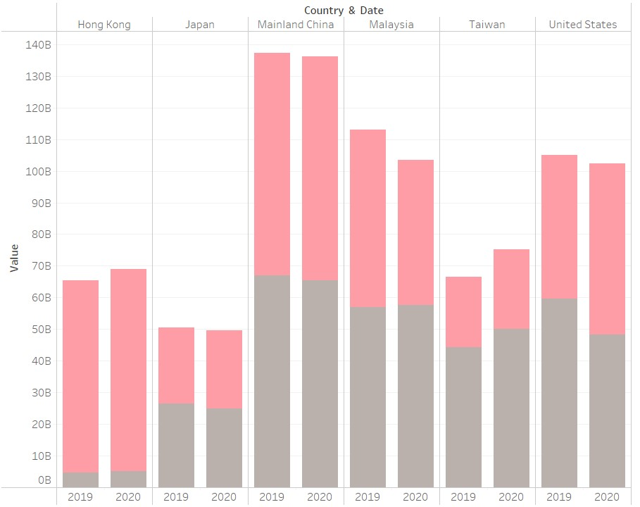

</center>
16.	Now the derived column, ‘Total Trade (SGD)’ is dragged to column pane.

<center>
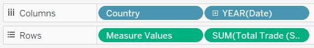{width=50%}

</center>

17.	Right click on the ‘Total Trade’ chart’s y-axis and click on the ‘Dual Axis’.

<center>
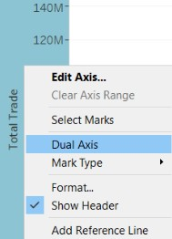{width=20%}

</center>
18.	Now the ‘Total Trade’ bar chart overlaps the stacked bar chart as the dual axis are in the same scale. Since both the axis are same, hide the y-axis present towards the right as it might confuse the readers.

<center>
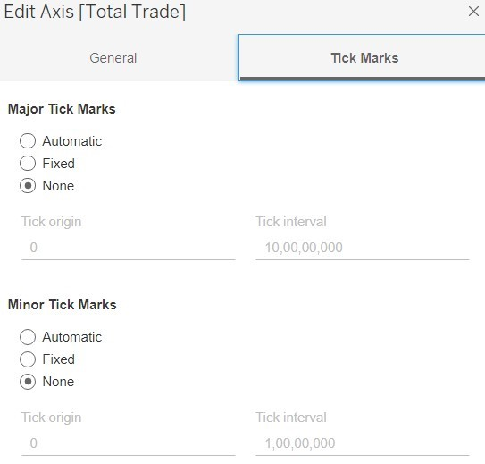{width=30%}

</center>
19.	Click on the dropdown symbol next to ‘SUM(Total Trade (SGD)’ and change the chart type from bar to line.

<center>
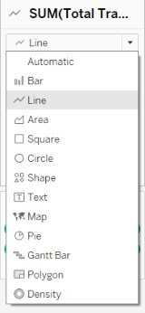{width=20%}

</center>
20.	Now drag the ‘Total Trade (SGD)’ column onto ‘Label’ icon. Total sum of the trade corresponding to that year is displayed as value on all the bar chart.

<center>
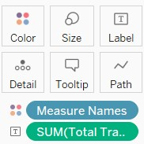{width=20%}

</center>
21.	Click the dropdown next to ‘SUM(Total Trade (SGD))’ label and select ‘Percent Difference’ from ‘Quick Table Calculation’.

<center>
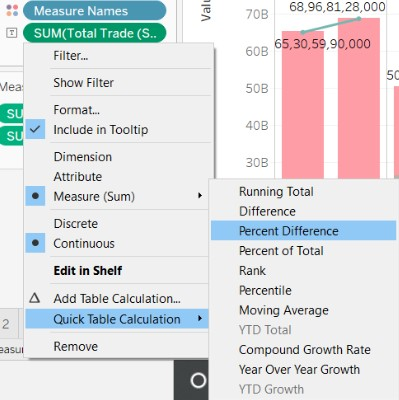{width=20%}

</center>
22.	Click on the ‘Add Table Calculation’ and select ‘Pane (Across)’  under compute method.

<center>
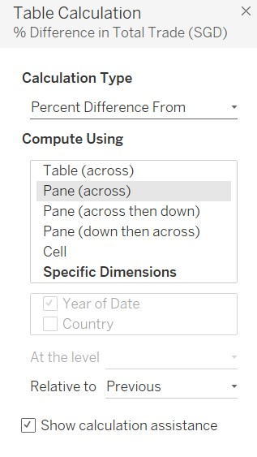{width=20%}

</center>
23.	Make the tick marks in the y-axis visible to naked eye since it is on a continuous scale.

24.	Right click on the white space in the chart and click on ‘Annotate’ to add annotations to highlight key insights.

<center>
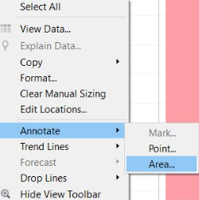{width=20%}

</center>
25.	The final chart is ready after adding title, axis labels and captions.

<center>
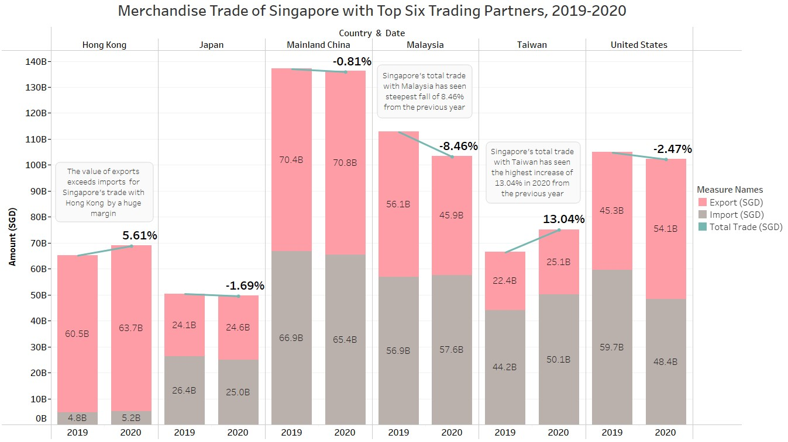

</center>
## 5.0	Derived Insights

1.	Out of the top six trading partners of Singapore, Mainland China has the highest merchandise trade value of S$137.31 billion and S$136.2 billion for the year 2019 and 2020 respectively.
2.	Except Taiwan and Hong Kong, the total trade value of the remaining four countries decreased in the year 2020 from that of the previous year.
3.	 Malaysia had the steepest fall of 8.46% in total trade value in the year 2020 from that of the previous year whereas on the other hand Taiwan witnessed the highest increase of 13.04% in the total trade value from that of the previous year.
4.	The value of import for Singapore’s trade with Hong Kong only contributes less than 8% in both the year 2019 and 2020 of the total trade. 

<center>
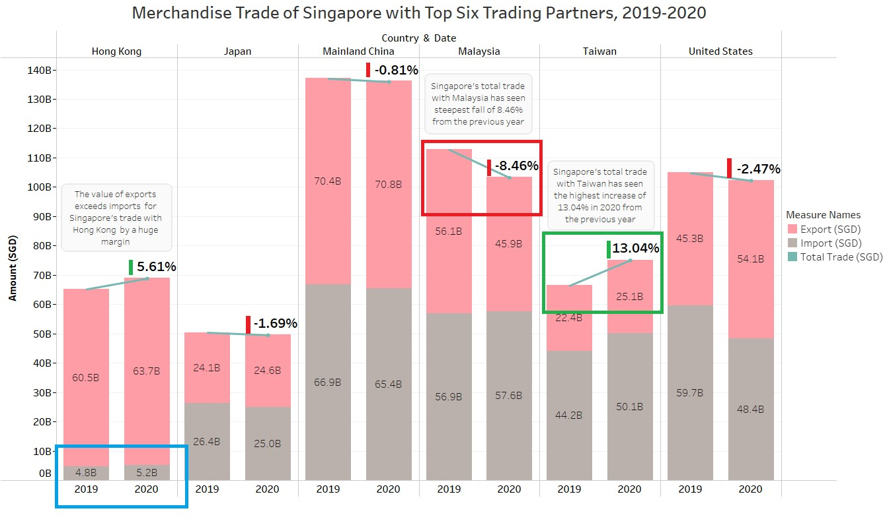

</center>

<center>
<font size="2">*This was written as part of requirements for the [Visual Analytics](https://wiki.smu.edu.sg/2021t2isss608/Course_information) course offered by [MITB](https://scis.smu.edu.sg/master-it-business).*</font size="2">
</center>


<div class="boxBorder">
Your text here...
</div>


