```{r setup, include=FALSE}
knitr::opts_chunk$set(echo = FALSE)
```

```{css}
.columns {display: flex;}
h1 {color: MidnightBlue;}
h2 {color: Navy;}
h3 {color: DarkSlateBlue;}
img{
    border: 2px LightGrey;
    border-style: solid
}
```

## 1.0 Critique of Visualization

The original visualization can be seen below.

<center>
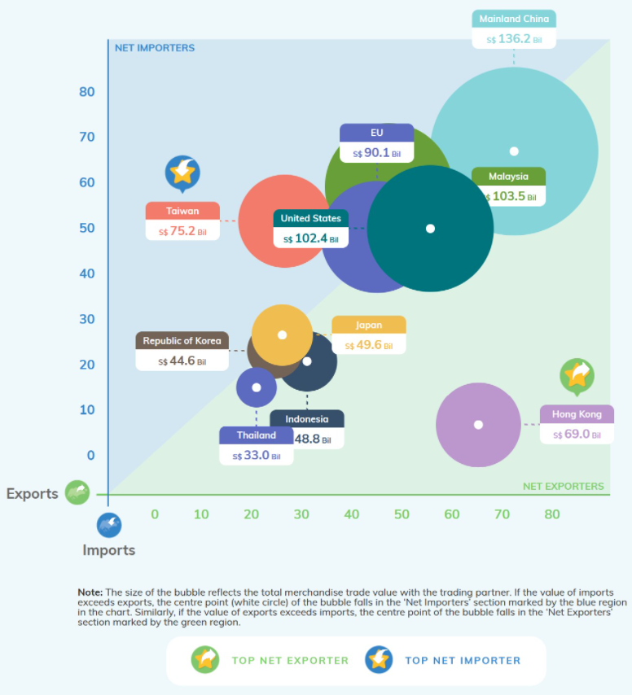

</center>
### 1.1 Clarity

1.	The title of the graph is not present. An enlightening data visualization will be incomplete
without a well-worded title, as it is one of the main components that grabs the attention of the people. Effective titles can reduce the mental effort of the readers and at the same time convey the intended goal of the visualization. 
2.	Both the axis has values ranging from 0 to 80 rightly representing exports and imports respectively but the if we look at the graph, few values labeled against each country exceed the value in the x-axis and y-axis scales. Though it may represent the summation of exports and imports, it lacks clarity from the readers’ point of view as it is hard to interpret the export/import values.
3.	Key performance measures of the two countries discussed below the visualization chart but since there is no information on the year for which the data has been visualized, it is very hard to relate.
4.	Though the x-axis and y-axis are labeled as exports and imports, the placement of the x-axis and y-axis labels are inappropriate which can possibly lead the reader to misinterpret easily.
5. 	European Union which is composed of 28 countries is present in the graph. Also, the countries which form the European Union are also present in the chart leading to biased comparison.

### 1.2 Aesthetics

1.	The circles used to represent individual countries overlap each other making it difficult to interpret the size of the circle. Also, the names corresponding to each circle don’t follow a uniform alignment.
2.	The x-axis and y-axis are on a continuous scale but tick marks are not present.
3.	Absence of gridlines makes it even harder to map the x-axis and y-axis values to the center of the circle.
4.	Similar colors are used for representing European Union and Thailand. 
5.	Annotations and tooltips are not efficiently used.

## 2.0 Alternative Design

The proposed design is as follows.

<center>


</center>
### 2.1 Clarity

1.	Title plays one of the key roles in grabbing the attention of the readers hence an appropriate chart title is given to the chart. Since the proposed dashboard has two visualizations, the main title is accompanied by two sub-titles that set the context for understanding the visualizations.
2.	The original chart is limited to only the top 10 trading partners by overall trade for the year 2020. But the proposed chart is highly customizable by users as the users will have the power to choose the year, trade type, top n, and bottom n countries. Hence it gives the user a wide variety of options to explore and compare as per their wish.
3.	The parameter change is dynamically aligned with the title and each entity has been labeled respectively. Additional information such as import/export/total trade was put under one roof inside the tooltip.
4.	Extended version of the slope chart is presented for the user to pick the countries of their wish and compare year-over-year growth of the trade. Trade growth increase/decrease corresponding to the previous year is represented by labels.
5.	In the slope chart presented, the monthly trend of import/export fluctuations was also included in the tooltip. The monthly trend gives added advantage to zoom in closely to look into any particular month and check how imports and imports have been affected by any historically significant event.
6.	The simple bar chart is used to list the top/bottom N countries by trade type. The slope chart on the right gives a detailed summary of the trend over 10 years. Since the selection of years is customizable the user can compare and contrast even for two or more years.

### 2.2 Aesthetics

1.	Bright and vibrant colors are used to distinguish the top 10 countries by corresponding trade type.
2.	The tool tops in both the visualizations are efficiently used to present import and export information for the corresponding parameter.
3.	Imports and exports visualizations present in the tooltip of both the charts are presented with uniform colors to avoid confusion. 
4.	The headers present in both the visualization get updated as the user changes the parameter. 
5.	The axis scale is hidden in both the visualization as the labels present against each datapoint infers the same information as that of the axis scale. Since both the charts are customizable, removing the labels can some extend give some space to avoid the overlapping issues to a certain extent.
6.	The year-over-year percentage growth is represented by red and green to show the increase/decrease in trend compared to the previous selected year.

## 3.0 Proposed Visualisation

Please view the interactive visualisation on [Tableau Public](## 3.0 Proposed Visualisation

Please view the interactive visualisation on [Tableau Public](https://public.tableau.com/app/profile/mayur4143/viz/DataVizMakeover1_16223530559820/Dashboard1) here.) here.

## 4.0 Step-by-step Guide

1. Unzip the downloaded file from the SingStat website.      the excel sheet(outputFile.xlsx) into Tableau Prep builder. The first five rows in the excel sheet contain non-tabular data which needs to be excluded.

<center>
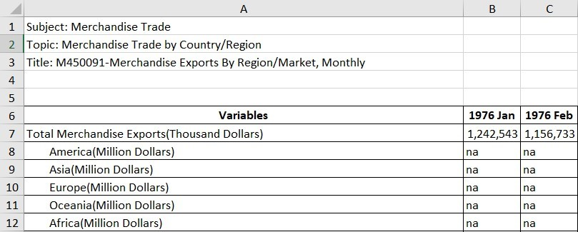

</center>
2. Upload the ‘outputFile.xlsx’ into the Tableau Prep software. Under the contents, there are two sheets ‘T1’ and ‘T2’ representing the imports and exports data respectively.

<center>
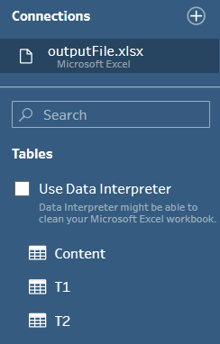{width=30%}

</center>
3.	In the ‘Tables’ pane, there is a check box to select the ‘Data Interpreter’. Click on the check box in order to remove the unwanted data which is present in the excel file in a non-tabular format.

<center>
{width=32.5%}

</center>
4.	From the ‘Tables’ pane, drag and drop the sheets ‘T1’ and ‘T2’ in the canvas space.

<center>
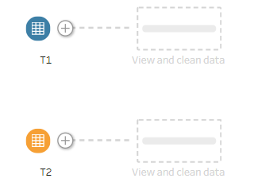{width=30%}

</center>
5.	Once the sheets ‘T1’ and ‘T2’ are in the canvas space, click on the small ‘+’ icon displayed right next to ‘T1’ and ‘T2’ and add ‘Clean Step’ to both sheets ‘T1’ and ‘T2’.

<center>
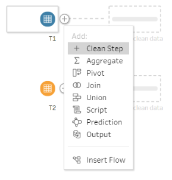{width=35%}

</center>
6.	Both the sheets ‘T1’ and ‘T2’ hold the data of imports and exports values respectively. Hence, rename the sheets ‘T1’ and ‘T2‘ as ‘Imports’ and ‘Exports’ respectively.

<center>
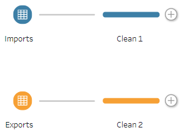{width=30%}

</center>
7.	By selecting the clean step node, exclude the first seven records under the ‘Variables’ column. Because the first record contains the total sum of the import/export values over all the years and the next five records have the import/export values of individual continents. And the last record which is ‘European Union’ comprises 27 countries. Since we already have the data of the individual countries present under the European Union, we exclude ‘European Union’.

<center>
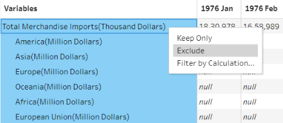{width=60%}

</center>
8.	As the analysis is restricted to years ranging from 2011 to 2020, all the other years that are before and after the ten-year range are excluded.

<center>
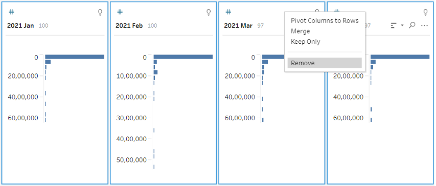{width=90%}

</center>
9.	The given data is in wide format (i.e) all the dates are present as columns. So, after the ‘Clean Step’ node, click on the small ‘+’ icon and add the ‘Pivot’ node to it.

<center>
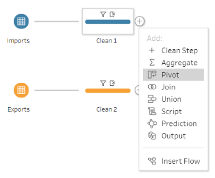{width=40%}

</center>
10.	Now, drag all the dates to the pivot panel where the records get pivoted from columns to rows. Basically, the wide-format data is converted to a long format. Then rename the ‘Variables’ column to ‘Country’ and ‘Pivot 1 Values’ to ‘Date’ respectively.

<center>
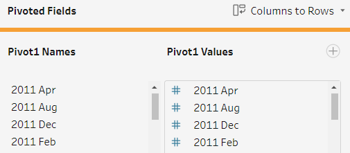{width=50%}

</center>
11.	The Tableau Prep automatically identifies and assigns the data type of each column present in the table. But at times it may be wrongly identified hence we have to perform a manual data type change. The recently pivoted column which contains all the dates is initially assigned with string datatype. Hence, the data type field is right-clicked and the data type is changed to date format. 

<center>
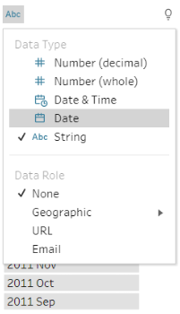{width=25%}

</center>
12.	The next step after pivoting is to add the output filed and run the flow to generate the pre-processed excel sheet. Add the ‘Output’ node to both the imports and exports sheet. Run the flow to generate ‘Imports.xlsx’ and ‘Exports.xlsx’ at the desired directory.

<center>
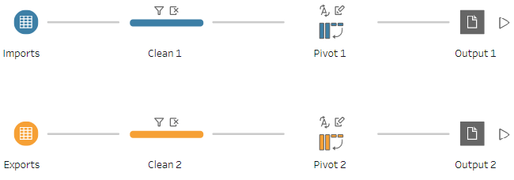{width=45%}

</center>
13.	Launch the Tableau application. Just drag and drop both the excel files ‘Imports.xlsx’ and ‘Exports.xlsx’ into Tableau.

<center>
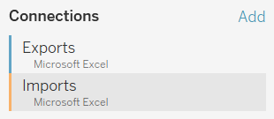{width=30%}

</center>
14.	The imports and exports table are present in a different sheet. So, we have to combine the data from both sheets into a single table for our analysis. Hence, drag the ‘Exports.xlsx’ sheet onto the workspace and double click on it. Now, just drag the ‘Imports.xlsx’ next to the exports table and drop it. By default, an inner join relationship represented by two intersecting circles is established between the column having the country name details.

<center>
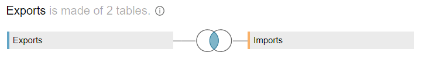{width=80%}

</center>
15.	In addition to the join condition with the ‘Country’ column in both the table, another join condition with the ‘Date’ column is established.

<center>
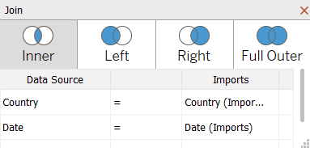{width=40%}

</center>
16.	Now the joined table has two country columns and two date columns. Hide the country and date column corresponding to any one of the tables in order to avoid duplicate columns.

<center>
{width=40%}

</center>
17.	In the ‘Country’ column all the country names are followed by ‘(Thousand Dollars)’ representing the scale. Custom split is used in order to split the country name alone by using ‘(‘ as the delimiter. Click on the arrow present in the ‘Country’ column and select ‘Custom Split’.

<center>
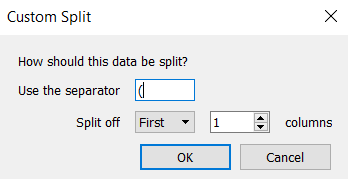{width=40%}

</center>
18.	The import and export values are given on thousand dollars scale. So, the import/export values are to be multiplied by 1000 to get the actual value of imports and exports. Hence, a new calculated field is created by clicking the arrow in the ‘Import (SGD)’ column and select ‘Create Calculated Field’.

<center>
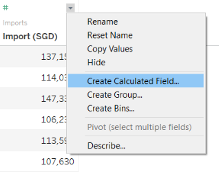{width=40%}

</center>
19.	Create a new calculated field by adding the import and export column in the formula box and multiply it with 1000 to get the actual value.

<center>
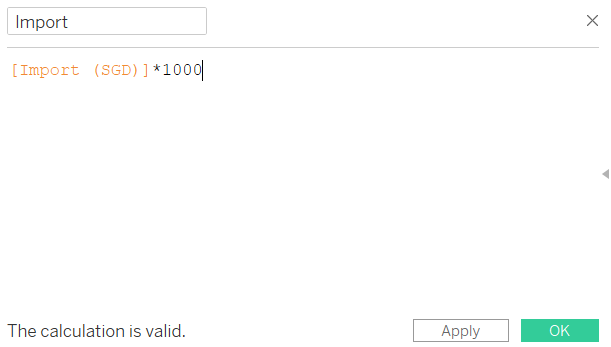{width=65%}

</center>
20.	Now we have the actual value of imports and exports corresponding to each country month-wise. Create a new calculated field ‘Total Trade’ to sum up both the ‘Export’ and ‘Import’ columns.

<center>
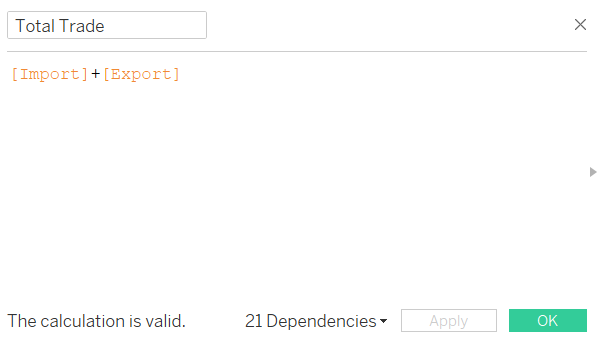{width=65%}

</center>
21.	The table-level pre-processing is completed. Now open a new worksheet by clicking on the ‘New Worksheet’ icon present towards the bottom of the application.

<center>
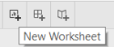{width=17.5%}

</center>
22.	Create a new parameter by selecting ‘Create parameter’ from the drop-down present next to the ‘Search’ bar.

<center>
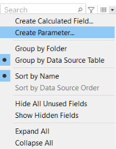{width=22.5%}

</center>
23.	‘Create parameter’ pop-up dialog box opens up. Create a new parameter ‘Trade Type’ with string datatype with a list consisting of Export, Import, and Total Trade for the users to select trade type of his/her interest.

<center>
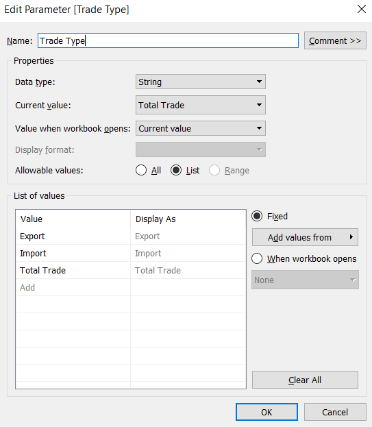{width=60%}

</center>
24.	Click on the down arrow present to the right of the ‘Search’ bar and select ‘Create Calculated Field’ with column name as ‘Selected Trade Value’ and enter the formula as shown in the table. Drag the newly calculated field ‘Trade Type’ onto the Columns pane. 

<center>
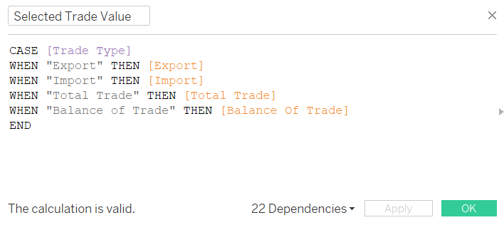{width=65%}

</center>
<center>
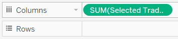{width=40%}

</center>
25.	Create another parameter named ‘Top or Bottom’ to give the users the flexibility to filter top N or bottom N countries as per the selected trade type.

<center>
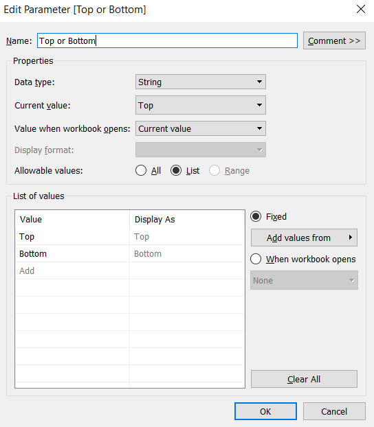{width=60%}

</center>
26.	Create a new calculated field ‘Dynamic Rank’ for displaying the ranks of all the countries based on selected parameters.

<center>
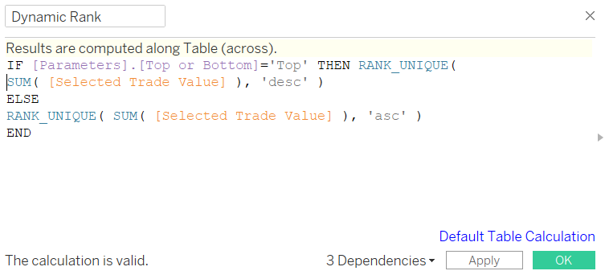{width=65%}

</center>
27.	Drop the newly calculated field ‘Dynamic Rank’ onto the Rows pane.

<center>
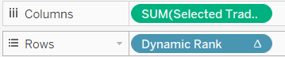{width=30%}

</center>
28.	Drag the ‘Country’ column to the color pane present under the Marks tool box in order to distinguish the countries based on the color.

<center>
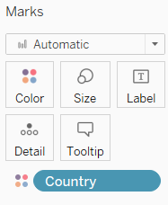{width=25%}

</center>
29.	Click on the arrow present towards the right of both the parameters ‘Top or Bottom’ and ‘Trade Type’, then select ‘Show Parameter’ to display the parameters onto the right of the worksheet.

<center>
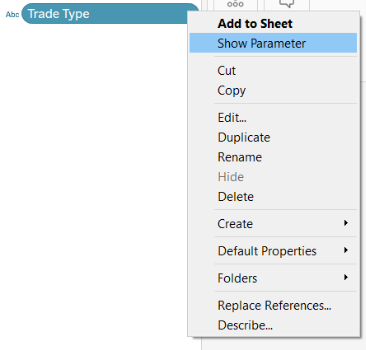{width=40%}

</center>
30.	Again, create a new parameter ‘Enter Value’ for the user to restrict the number of countries that have to be displayed.

<center>
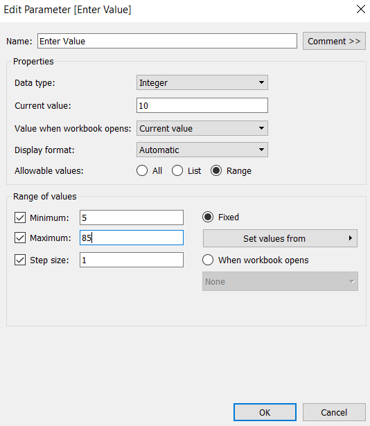{width=60%}

</center>
31.	Drag the ‘Date’ column to the Filter box and select the range of values as ‘Year’. A pop-up box gets displayed, select all the years. Once the filter is created, click on the down arrow present towards the right of it and select ‘Show Filter’ in order for the user to filter by year.

<center>
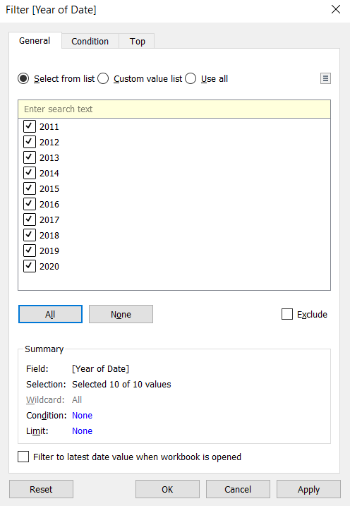{width=60%}

</center>
32.	 Click on the small arrow in the year filter and select ‘Single Value (dropdown)’ to restrict the user to select only one year.

<center>
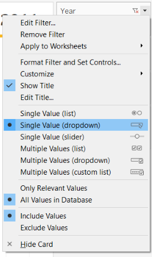{width=30%}

</center>
33.	Right-click on the ‘Country’ column and select ‘Create’ followed by ‘Set’ to create a new set. Create two-country sets for the top and bottom filter respectively. So once the user inputs the desired value into the parameter, the number of countries displayed in the chart gets restricted to the user input value.

<center>
{width=55%}

</center>
34.	Create a calculated field to display the top and bottom countries as per the parameter change.

<center>
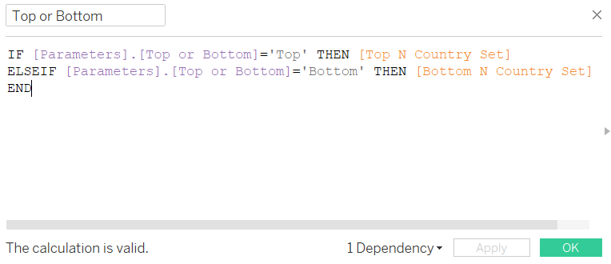{width=65%}

</center>
35.	A new worksheet is opened and a basic bar graph is created by adding the ‘Date’ and ‘Measure Names’ in the Columns pane. ‘Country’ and ‘Measure Values’ are dropped in the rows field.  From the measure values, all the other column data except the exports and imports are removed since this will include only the exports and imports data in a bar chart format inside the tooltip of the previously created chart. 

<center>
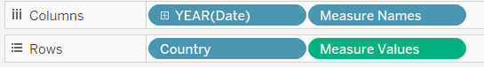{width=50%}

</center>
<center>
{width=25%}

</center>
36.	Add ‘Country’ and ‘Selected Trade Type’ in the labels. And in the tooltip, add the columns exports, imports, and total trade value. The chart along with the label and tooltip is displayed as shown in the screenshot. 

<center>
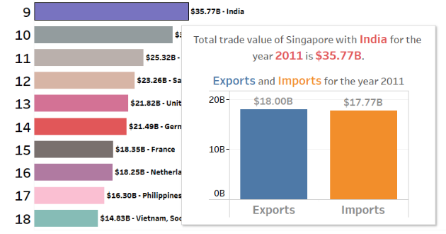{width=80%}

</center>
37.	The completed visualization is shown in the screenshot.

<center>
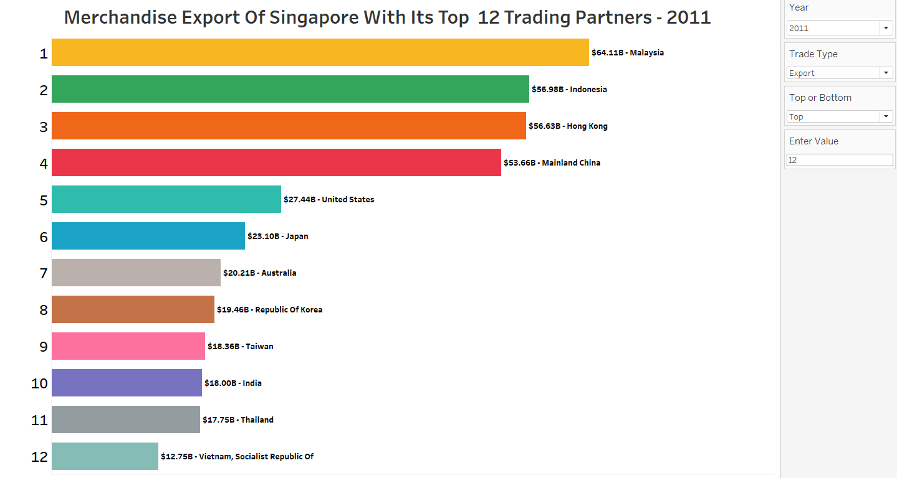

</center>
<center>
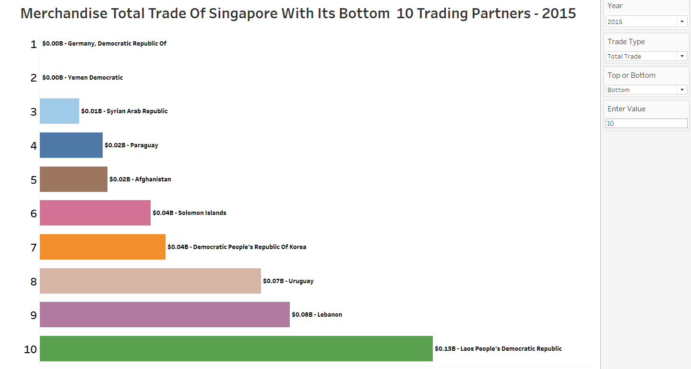

</center>
38.	Open a new worksheet for the next visualization. The previous visualization was to explore the trading partners with respect to the trade type to find the top/bottom N countries. The next visualization is on a country-level visualization showing the year-over-year growth of the countries of the user’s choice. Firstly, Drag the column ‘Date’ to the columns pane. 

<center>
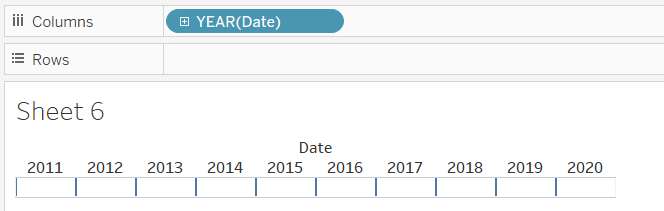{width=70%}

</center>
Add ‘Selected Trade Value’ to the Rows pane. The chart obtained is now is bar graph. Convert the bar graph into a line graph under the Marks tool box.

<center>
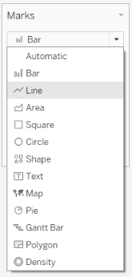{width=25%}

</center>
39.	Drag and drop the ‘Country’ column onto the ‘Detail’ pane under the Marks tool box.

<center>
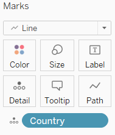{width=25%}

</center>
40.	Click on the arrow present towards the right of the ‘Selected Trade Value’ present in the Rows pane and uncheck ‘Show header’ from the dropdown list as the value of the measure would be labeled against each data point in the line graph.

<center>
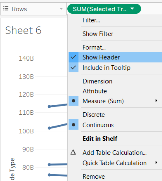{width=40%}

</center>
41.	The Rows pane has the column ‘Selected Trade Value’ already in place. In addition, add the same column next to it.

<center>
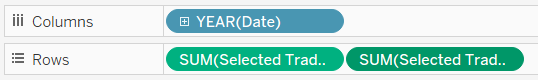{width=50%}

</center>
42.	Select the pane under the Marks tool box that corresponds to the newly added column and change the chart type from line to circle. In this way, only the dots remain in the graph.

<center>
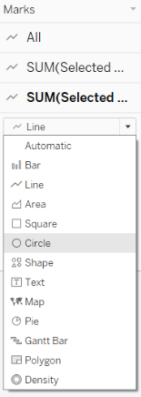{width=22.5%}

</center>
43.	Adjust the size of the circle to make sure it is not too big or too small. So that once the dot gets overlapped with the line graph, it doesn’t look odd.


<center>
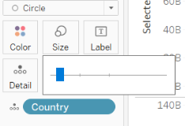{width=30%}

</center>
44.	Right-click on the axis of the newly created chart with dots and click on dual-axis to merge both the charts. The two graphs which were present one over the other get clubbed together into a single graph sharing a common x-axis.

<center>
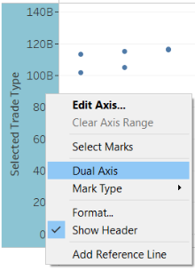{width=30%}

</center>
45.	Though both the y-axis has the same scale, there might be a slight difference between them which can make dots appear separately from the line. So, right-click on any one of the axes and click on synchronize axis.

<center>
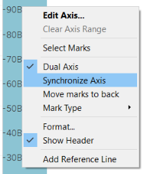{width=30%}

</center>
46.	Right-click on the ‘Trade Type’ parameter which was created as a part of the first chart and click on the ‘Show Parameter’ from the dropdown to display the trade type parameter towards the right of the chart. Add ‘Date’ and ‘Country’ to the Filters pane.

<center>
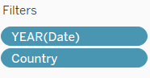{width=25%}

</center>
47.	Right-click on the ‘Date’ and ‘Country’ columns from the Filters pane and select ‘Show Filter’ from the dropdown list. Both the filters get displayed towards the right of the worksheet.

<center>
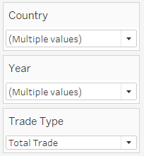{width=25%}

</center>
48.	‘Country’ column is added to the color pane under the Marks tool box for both the line graph and circle graph so that both are in the same color. The main reason for adding colors is to differentiate each country when the number of countries chosen by the customer exceeds the threshold which may lead to text overlap.

<center>
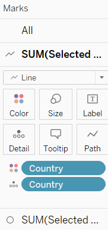{width=20%}

</center>
49.	Now add the ‘Country’ column to the Label pane corresponding to the line graph and the ‘Selected Trade Value’ column to the Label pane corresponding to the dot graph.

<center>
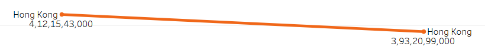{width=75%}

</center>
50.	The trade value in the graph is displayed with too many digits which may lead to ambiguity among the readers, hence right-click on the ‘Selected Trade Value’ label under the Marks toolbox and select ‘Format’.

<center>
{width=25%}

</center>
51.	Clicking on the ‘Format’ opens a new pane towards the left. Click on the ‘Numbers (Custom)’ and select display units as Billions (B) for easy readability.

<center>
{width=60%}

</center>
<center>
{width=75%}

</center>
52. A new calculated field ‘Percent Of Total’ is created by dividing the sum of the ‘Selected Trade Type’ column by the total sum of ‘Selected Trade Type’.

<center>
{width=65%}

</center>
53.	The objective is to obtain the percentage difference between the current year to the previous year. Hence, another calculated field is created by using the newly created calculated column from the previous step.

<center>
{width=65%}

</center>
54.	Create another two calculated fields to represent if the percentage difference is positive or negative.

<center>
{width=65%}

</center>
<center>
{width=65%}

</center>
55.	Add the newly created columns ‘Positive’ and ‘Negative’ in the Label pane from the Marks tool box to display the percentage difference in red and green color to visually indicate the trade increase/decrease.

<center>
{width=75%}

</center>
56.	In order to further look at the monthly import and export for a particular year and country, a basic line chart is created in a new worksheet with ‘Year’ and ‘Month’ in Rows pane and ‘Country’ and ‘Import’, ‘Export’ columns in the Columns pane.

<center>
{width=50%}

</center>
57.	Now the tooltip pane is opened and the necessary modification is done to include all the required fields so that even if there are any textual overlaps, the users can hover over the data point to get the complete information for that corresponding year and country.

<center>
{width=60%}

</center>
58.	The completed visualization is shown in the screenshot.

<center>


</center>
<center>


</center>
<center>


</center>
## 5.0	Derived Insights

1. Over the ten years time period from 2011 to 2020, Hong Kong remains as the top net exporter of Singapore. The net exports reached the peak of 60.76 Billions in the year 2018 followed by a decline of 8.21% in the 2019. But the net exports has increased in the next year by 4.91% though the whole year was worst hit by COVID-19 pandemic. Followed by Hong Kong, Indonesia consistently held thee second position when it comes to net exports from 2011-2019 but drops to fourth position in the year 2020 alone.

<center>


</center>
2. Unlike the net exporter, the top net importer was not consistently held by a single partner for all the ten years from 2011-2020. From 2012-2017, United States was the top net importer of Singapore but from 2018-2020 Taiwan became the top net importer of Singapore.

<center>


</center>
3. The total trade is calculated by summing the exports and imports. By looking at the bar chart from the year 2011 to 2020 we can say that China, Malaysia, United States, Indonesia, Japan were the Singapore's key trading partners. Malaysia held the top spot for total trade in the year 2011 and 2012 but on 2013 China dethroned Malaysia to become the top trading partner. And from 2013 to 2020, Mainland China retained its top position reaching its peak in the year 2019 summing up to 137.31 Billions.

<center>


</center>
4. The top trading partners China, Malaysia, Indonesia, United States, and Japan are compared by the total trade value for 2011 vs 2020. It can be observed that only Mainland China and United States showed a total trade growth of 33.86% and 35.01% respectively while a declining trend is noticed for all other trading partners.

<center>


</center>
The tooltip flyout gives us the monthly imports and exports trend corresponding to the selected year. Since, circuit breaker was implemented in Singapore from April 7th most of the countries showed a declining trend around that time period.

