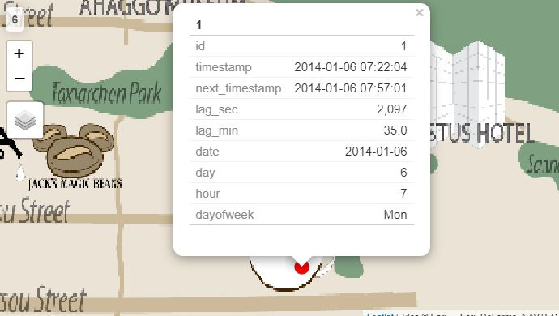

```{r setup, include=FALSE}
knitr::opts_chunk$set(echo = TRUE, message = FALSE, error=FALSE)
```

```{r}
packages = c('raster','sf','tmap','tidyverse','clock','rgdal','tidytext','widyr',
             'DT','dplyr','hms','ggraph','igraph','crosstalk',
             'plotly','data.table','stringi','mapview','ggridges','networkD3',
             'htmlwidgets')

for(p in packages){
  if(!require(p, character.only = T)){
    install.packages(p)
  }
  library(p, character.only = T)
}
```

**Loading data**

```{r}
cc <- read_csv(file = 'data/cc_data.csv')
lc <- read_csv(file = 'data/loyalty_data.csv')
bgmap <- raster("data/MC2-tourist.tif")
Abila_st <- st_read(dsn = "data/Geospatial",
                    layer = "Abila")
gps <- read_csv("data/gps.csv")
net <- read_csv(file = 'data/car-assignments.csv')
```

## Task 2
**Add the vehicle data to your analysis of the credit and loyalty card data. How does your assessment of the anomalies in question 1 change based on this new data? What discrepancies between vehicle, credit, and loyalty card data do you find? Please limit your answer to 8 images and 500 words.**

**Plotting Raster Layer**

```{r }
tm_shape(bgmap) +
  tm_rgb(bgmap, r = 1, g = 2, b = 3,
         alpha = NA,
         saturation = 1,
         interpolate = TRUE,
         max.value = 255)
```

The map of Abila gives us a clear picture of the distance that GASTech is away from the other locations visited by the employees. From the map of Abila, the most frequented locations such as Katerina's Cafe, Guy's Gyros, Brew've Been Served were all seems to be in close proximity with GASTech. Hippokampos was the second most frequented location but surprisingly it was not present in the map. Since the top 4 frequented locations are closely located, I assume Hippokampos also should be near to GASTech.

**Converting Date-Time field and ID field**

```{r }
gps$Timestamp <- date_time_parse(gps$Timestamp,
                                 zone = "",
                                 format = "%m/%d/%Y %H:%M:%S")
gps$id <- as_factor(gps$id)
```

**Converting Aspatial Data Into A Simple Feature data Frame**

```{r }
gps_sf <- st_as_sf(gps,
                   coords = c("long","lat"),
                   crs = 4326)
```

```{r }
gps_sf <- gps_sf %>%
  mutate(day = get_day(Timestamp),
         hour = get_hour(Timestamp),
         dayofweek = date_weekday_factor(Timestamp) ,
         date = as_date(Timestamp))
```

```{r}
glimpse(gps_sf)
```

**Creating Movement Path From GPS Points**

The code chunk below joins the GPS points into movement paths by using car id, date and hour as unique identifiers.

```{r }
gps_path <- gps_sf %>%
  group_by(id, date, hour) %>%
  summarize(timestamp= mean(Timestamp),
            do_union=FALSE) %>%
  st_cast("LINESTRING")
```

**Finding the orphan lines**

After getting the movement paths we do see some orphan GPS points hence finding those orphan lines.

```{r} 
p = npts(gps_path, by_feature = TRUE)
gps_path2 <- cbind(gps_path, p)
```

**Removing the orphan lines**

```{r} 
gps_path3 <- gps_path2[!(gps_path2$p==1),]
```

**Plotting the GPS Paths**

Below code chunk is used to overplot the GPS path of all the car ids onto the background tourist map.

```{r }
gps_path_selected <- gps_path3
tmap_mode("plot")
tm_shape(bgmap) +
  tm_rgb(bgmap, r = 1, g = 2, b = 3,
         alpha = NA,
         saturation = 1,
         interpolate = TRUE,
         max.value = 255) +
  tm_shape(gps_path_selected) +
  tm_lines(col='red')
```

Previously using the heat map plot on location vs hour of transaction shows that there are some transactions recorded at early morning around 3 am - 4 am at Kronos Mart. Hence further plotting the GPS path during the time period to see if any car id had passed by that way.

```{r }
gps_path_selected <- gps_path3 %>%
  filter(hour==3)
tmap_mode("plot")
tm_shape(bgmap) +
  tm_rgb(bgmap, r = 1, g = 2, b = 3,
         alpha = NA,
         saturation = 1,
         interpolate = TRUE,
         max.value = 255) +
  tm_shape(gps_path_selected) +
  tm_lines(col="red") 
```

It can be seen from the GPS data that no car had passed by Kronos mart or its near by locations between 3 am - 4 am. Hence the employee should have taken his personal vehicle or should have visited that particular location by a walk in order to hide his/her identity. The owners of credit card numbers ending with 8332, 9551 and 3484 are those who had made transaction on 19/01/2014 (Sunday) between 3 am - 4 am. Transaction gap between credit card numbers 8332 and 9551 were only three minutes. And all the three transactions were made without the use of loyalty cards.

The last 4 digit of the credit card is 2463 for the transaction between 10pm-11pm on 10/01/2014 Friday at location Hippokampos. But surprisingly the particular location is not seen in the map.

Below GPS path had been plotted for car id 28.
 
```{r }
gps_path_selected <- gps_path3 %>%
  filter(id == 28)
tmap_mode("plot")
tm_shape(bgmap) +
  tm_rgb(bgmap, r = 1, g = 2, b = 3,
         alpha = NA,
         saturation = 1,
         interpolate = TRUE,
         max.value = 255) +
  tm_shape(gps_path_selected) +
  tm_lines(col="red") 
```

By glazing through the routes visited by the employee car 28, there is an evident difference observed in the GPS path of car ID 28. Other car IDs have some regular pattern but the path taken by car ID 28 is highly disoriented and has many off-road impressions.

```{r }
gps_path_selected <- gps_path3 %>%
  filter(date=='2014-01-13' & hour>=19 & hour<20)
tmap_mode("plot")
tm_shape(bgmap) +
  tm_rgb(bgmap, r = 1, g = 2, b = 3,
         alpha = NA,
         saturation = 1,
         interpolate = TRUE,
         max.value = 255) +
  tm_shape(gps_path_selected) +
  tm_lines(col="red") 
```

Car IDs - 13,15,16,34 GPS points impression can be seen around Frydos Autosupply on 13/01/2014 between 7pm-8pm as there was an unusal transaction. It will be further analysed at a later stage.

## Task 3
**Can you infer the owners of each credit card and loyalty card? What is your evidence? Where are there uncertainties in your method? Where are there uncertainties in the data? Please limit your answer to 8 images and 500 words.**

**Finding the lag**

Since the GPS moving data is captured, it is hard to find the location were the car had stopped to make a transaction. So, I have taken the difference between consecutive timestamp grouped by ids and filter the points with more than 2 minutes difference.

```{r}
gps_lag <- gps_sf %>%
  group_by(id) %>%
  mutate(next_timestamp = lead(Timestamp, order_by = Timestamp))
```

```{r}
names(gps_lag)[names(gps_lag)=='Timestamp'] <- 'timestamp'
gps_lag <- gps_lag[c("id","timestamp", "next_timestamp","date","day","hour","dayofweek","geometry")]
```

```{r}
gps_lag$lag_sec <- as.numeric(gps_lag$next_timestamp - gps_lag$timestamp)
gps_lag <- gps_lag[c("id","timestamp", "next_timestamp","lag_sec", "date","day","hour","dayofweek","geometry")]
gps_lag <-gps_lag[order(gps_lag$id, gps_lag$timestamp),]
gps_lag$lag_min <- as.numeric(gps_lag$lag_sec)/60
gps_lag <- gps_lag[c("id","timestamp", "next_timestamp","lag_sec","lag_min", "date","day","hour","dayofweek","geometry")]
```

Filtering only the stationary points where the car has stopped for more than 2 minutes and less than 360 minutes (i.e) 6 hours. An employee is assumed to be at his home if the time lag between consecutive points are more than 6 hours.

```{r}
gps_loc <- gps_lag %>%
  filter(lag_min>2, lag_min<360)
```

Preparing the data to plot as dots on the background tourist map.

```{r }
gps_loc <- separate(gps_loc, geometry, into = c("long", "lat"), sep = ",")
gps_loc$long <- gsub("c\\(", "", gps_loc$long)
gps_loc$lat <- gsub("\\)", "", gps_loc$lat)
```

```{r}
gps_dot_sf <- st_as_sf(gps_loc,
                       coords = c("long","lat"),
                       crs = 4326)
```


```{r}
glimpse(gps_dot_sf)
```

Previously movement data had been plotted onto the background tourist map. Now the stationary points data is plotted onto the background tourist map. The day is filtered to 6 for now but during analysis, the filter criteria would be changed to meet the needs.

```{r}
gps_dot <- gps_dot_sf %>%
  filter(day==6)

tmap_mode("plot")
tm_shape(bgmap) +
  tm_rgb(bgmap, r = 1, g = 2, b = 3,
         alpha = NA,
         saturation = 1,
         interpolate = TRUE,
         max.value = 255) +
tm_shape(gps_dot)+
tm_bubbles(col = "red",
           size = 1, 
           size.max = 1,
           border.col = "black",
           border.lwd = 1) +
  tm_facets(by = 'id',
            ncol = 1,
            scale.factor = 5)
```

Below csv file holding the car id, name, department, employee designation are loaded into a dataframe.

```{r}
net <- read_csv(file = 'data/car-assignments.csv')
```

**Combining the first name and last name of the employees**

The first name and the last name column are combined together to get the full name of the employee after which the first name and last name columns are dropped as they are no longer needed.

```{r}
net <- net %>%
  unite('Merged', LastName:FirstName, sep= " ", remove = FALSE)
net <- net %>%
  rename(Name = Merged)
glimpse(net)
net <- select(net, -c(FirstName, LastName))
```
In order to link the employee name to credit card details, the GPS points are plotted in the map as dots for each card id using the facet function and then filtered by any one day of the month. So now we have the dots in the map with stop time and start time as shown below.

<center>


</center>

It can be inferred from the snapshot above that car id 1 had stopped at Hallowed grounds on 2014-01-06 for about 35 minutes from 7:22 am to 7:57 am. Now the same record is to verified from credit card DT table as shown below.

<center>


</center>

It can seen that there are few transactions that took place between 7:22 am and 7:57 am on 2014-01-06. So in this case we have see for other points in the map where the car had stopped and repeat the same process. If we can pinpoint on one of the credit card details without any overlap from other transactions, then we can link the corresponding credit card and car id. Sometimes it gets complicated so in these cases we have look for different days to zero down on the car id and credit card number.

**Mapping the car assignment based on last 4 digits of the credit card**

```{r}
cc_full <-cc %>%
  mutate(CarID = case_when(
    last4ccnum == "9551" ~ 1,
    last4ccnum == "4434" ~ 2,
    last4ccnum == "8332" ~ 3,
    last4ccnum == "7688" ~ 4,
    last4ccnum == "6899" ~ 5,
    last4ccnum == "7253" ~ 6,
    last4ccnum == "1321" ~ 7,
    last4ccnum == "7889" ~ 8,
    last4ccnum == "3853" ~ 9,
    last4ccnum == "9635" ~ 10,
    last4ccnum == "7117" ~ 11,
    last4ccnum == "7108" ~ 12,
    last4ccnum == "5368" ~ 13,
    last4ccnum == "1874" ~ 14,
    last4ccnum == "9241" ~ 15,
    last4ccnum == "2142" ~ 16,
    last4ccnum == "8411" ~ 17,
    last4ccnum == "9617" ~ 18,
    last4ccnum == "6895" ~ 19,
    last4ccnum == "6816" ~ 20,
    last4ccnum == "4948" ~ 21,
    last4ccnum == "2681" ~ 22,
    last4ccnum == "3484" ~ 23,
    last4ccnum == "9405" ~ 24,
    last4ccnum == "5921" ~ 25,
    last4ccnum == "1310" ~ 26,
    last4ccnum == "3492" ~ 27,
    last4ccnum == "7384" ~ 28,
    last4ccnum == "3547" ~ 29,
    last4ccnum == "7819" ~ 30,
    last4ccnum == "7792" ~ 31,
    last4ccnum == "2540" ~ 32,
    last4ccnum == "9683" ~ 33,
    last4ccnum == "8202" ~ 34,
    last4ccnum == "8156" ~ 35
    )
)
```


```{r}
glimpse(cc_full)
```

```{r}
temp <- net[c("CarID", "Name")]
cc_full <- left_join(cc_full, temp, by = "CarID")

cc_full_nonull <- cc_full %>% filter(!is.na(CarID))
```

```{r}
temp2 <- cc_full_nonull[,c("timestamp","CarID","Name","location","price","last4ccnum","date")]

temp3 <- lc[,c("timestamp","location","price","loyaltynum")]

dt_linked <- left_join(temp2, temp3, by = c("date" = "timestamp", "location" = "location", "price" = "price"))
  
DT::datatable(dt_linked,
              filter = 'top') %>%
  formatStyle(columns = 1,
              target = 'row',
              lineHeight = '100%') %>%
  formatDate(1, "toLocaleString") %>%
  formatDate(7, "toLocaleDateString")
```
The interactive data table above provides the car id and name of the employee linked to the credit card and loyalty card details.


